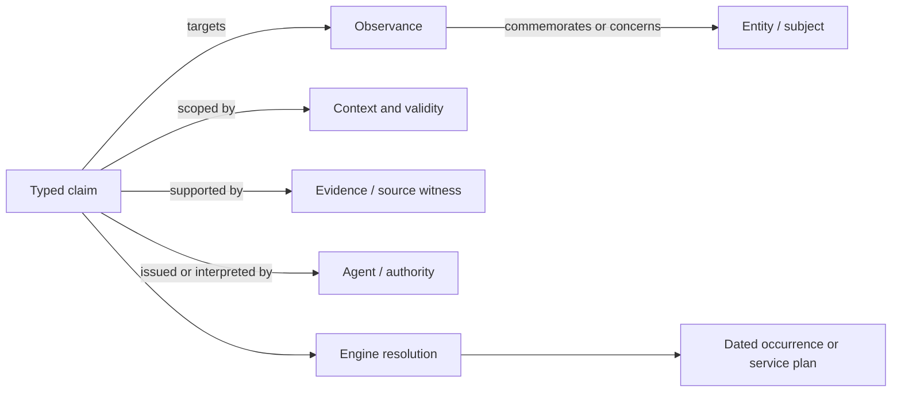

# Research-derived domain model

Status: **accepted Phase 2 working hypothesis, not a schema**. Field names and
examples in this document are illustrative. They must not be treated as a
compatibility promise, and adversarial/domain review can still revise the model.

## Core distinction

The research supports a refinement of the initial “entity → observance → usage”
idea:



“Usage” should not be the universal middle layer. An observed parish calendar,
an official prescription, an editor's inference, and a generated occurrence
have different evidential force. The common abstraction is a **claim**. An
observed usage is one claim mode or a witness supporting a claim; it is not the
same thing as a normative rule.

## Candidate concepts

### Entity

A stable identity anchor for something that may be the subject of one or more
observances. Candidate entity kinds include:

- person;
- recognized collective or synaxis;
- sacred or historical event;
- icon, relic, or other material object;
- place or institution when liturgically relevant;
- another typed subject supplied by a vocabulary.

An entity is not a biography and carries no universal feast date or rank. Its
kind is a vocabulary reference, not an English enumeration baked into every
schema.

### Observance

A stable identity anchor for a liturgical commemoration or occasion. It can
concern zero, one, or many entities through typed participation claims.

Examples include a saint's repose, translation of relics, glorification, a
synaxis, an icon feast, an appearance, a dedication, a historical deliverance,
or a day in a movable cycle. The ordinary commemoration and translation of
Nicholas of Myra are separate observances linked to the same person.

An observance is not automatically universal. Its existence, title, date rule,
rank, and readings may be supported or prescribed by different sources in
different contexts.

### Claim

A typed assertion about an identified target. Rather than making every record a
bag of RDF-like property/value triples, OOLDS should define a small family of
typed claims sharing a common envelope.

Likely claim types:

- participation: an observance commemorates or concerns an entity;
- name: a language- and context-specific appellation for a target;
- classification: a target is assigned a vocabulary term;
- date-rule assignment: an observance follows a recurring rule;
- rank: an observance has a term in a named rank scheme;
- fasting: a named fasting scheme assigns a practice or feature in a context;
- tone: a tone-cycle position or tone is associated with an observance or
  occurrence under a declared scheme;
- lection appointment: a lection is appointed in a service context;
- relationship: patronage, membership, succession, authorship, depiction, or
  another vocabulary-defined relation;
- identity mapping: exact match, close match, possible match, supersession, or
  disjointness between identifiers;
- status or reception: approved, glorified, locally received, deprecated, or
  another vocabulary-defined state.

A claim envelope needs, as applicable:

- a persistent claim ID;
- issuer or responsible editor;
- claim mode, such as prescribed, attested usage, editorial interpretation, or
  automated derivation;
- explicit scope;
- valid time and record publication state;
- evidence links and exact locators;
- confidence or certainty, when uncertainty is real;
- revision and supersession links.

Avoid one overloaded `status` field. Publication lifecycle (`draft`, `published`,
`superseded`, `withdrawn`), review state (`unreviewed`, `reviewed`, `disputed`),
claim mode (`prescribed`, `attested usage`, `editorial interpretation`), and
epistemic certainty are independent axes. Vocabularies may supply their exact
terms, but consumers must be able to tell which axis a term qualifies.

The specification should not force every simple record to repeat all fields.
Pack-level editorial defaults may be permitted, but normalized output must make
the effective issuer, rights, and vocabulary bindings recoverable.

### Context

Context is multidimensional. A single `tradition: russian` string is not enough.
A claim may be scoped by any combination of:

- church, jurisdiction, diocese, monastery, parish, or other community;
- liturgical tradition or Typikon lineage;
- geography;
- language, script, or edition;
- service and position within a service;
- calendar reckoning and paschalion;
- valid date range or a particular liturgical year;
- intended use or audience.

These dimensions should be independent references. A hierarchy such as
“diocese belongs to church” is itself sourced and time-dependent; it must not be
hard-coded as an eternal tree.

### Agent, authority, source, and evidence

These are separate:

- **Agent:** a person, organization, or software process responsible for an
  action or assertion.
- **Authority role:** the capacity in which an agent issues a claim within a
  scope. Authority is a relationship, not a synonym for source.
- **Source:** an identifiable publication, database release, manuscript,
  webpage, decree, calendar, or other resource.
- **Evidence:** the use of a source, with locator, access date, quotation or
  extracted fact where permitted, and the derivation method.
- **Witness:** a source that records a concrete practice or annual outcome
  without necessarily prescribing a perennial rule.

This borrows the useful distinctions of W3C PROV while remaining usable in
ordinary JSON or YAML.

### Work, expression, edition, and asset

Text and media require a lightweight catalog extension:

- **Work:** an intellectual or liturgical work independent of language and
  encoding.
- **Expression:** a language-, recension-, translation-, arrangement-, or
  notation-specific realization.
- **Edition:** a published or edited manifestation with responsibility and
  revision history.
- **Asset:** a concrete file, URL, API representation, or media object with a
  checksum, media type, and rights.

OOLDS should link to TEI, OSIS, Markdown, MEI, PDF, image, or audio assets. It
should not attempt to replace those formats.

### Vocabulary and term

Extensible classifications require identifiable vocabularies whose owners and
versions are declared. A term reference consists of a vocabulary ID and term
ID; its labels are localized data, not its identity.

Candidate vocabulary domains include entity kinds, observance types,
participant roles, claim modes, services, service positions, rank schemes,
fasting schemes, source roles, calendar reckonings, paschalions, canons,
versifications, and relationship types.

A rank value is never just `4`, `vigil`, or `great`. It is a term in a named,
versioned rank scheme. Cross-scheme mappings are claims, not arithmetic.

### Rank, fasting, and tone claims

These domains share a pattern but do not share a universal scale. A rank claim
has a scheme reference, term, context, issuer, validity, and evidence. A
tradition pack may additionally expose descriptive features such as vigil,
polyeleos, or great doxology, but those features are terms in their own declared
vocabulary and do not create a universal precedence ladder.

Basic fasting and tone claims can use the same claim envelope. Their interaction
with season, weekday, collision, dispensation, service, or cycle is resolution
policy. Cross-scheme mappings may be published as non-normative mapping claims
with evidence; generic consumers must not infer equivalence from similar English
labels.

## Identifier model

### Federated identifiers

The working recommendation is:

1. Every persistent object has an immutable absolute identifier.
2. Packs may use compact identifiers of the form `prefix:kind:local-id` for
   authoring, but the manifest must map `prefix` to an issuer-controlled
   namespace IRI.
3. An optional `oolds` namespace can hold collaboratively governed identities;
   it is not required for interoperability.
4. Existing identifiers from Ponomar, Orthocal, Pinakes, Wikidata, BHG, library
   catalogs, publishers, and pack maintainers remain typed external mappings.
5. Names, dates, database row numbers, and file paths are not identifiers unless
   their issuer explicitly governs them as persistent IDs.

The exact identifier grammar is a Phase 4 specification decision. UUIDs may be used, but
mandating them would not solve namespace authority, merge history, or human
reconciliation.

Illustrative compact IDs—not reserved or normative—include:

```text
oolds:person:nicholas-myra
oolds:observance:nicholas-myra-dec-6
oolds:observance:nicholas-relics-bari
oca:observance:local-example
```

Their meaning depends on manifest-declared prefix expansion. A generic loader
must never infer the issuer from the spelling alone.

### Lifecycle

- An ID is never reused, including after deletion.
- A label change does not change an ID.
- Exact one-to-one replacement may use a tombstone plus a reviewed redirect.
- A merge preserves all former IDs and evidence; it does not erase the losing
  records.
- A split tombstones or limits the old record and points to multiple successors;
  it cannot pretend there is one exact redirect.
- Disputed identity uses competing mapping claims with evidence and confidence.
- Identity mapping may state exact, close, possible, broader, narrower,
  supersedes, or disjoint relations. Only an issuer may declare its own
  identifier redirected; another pack can only assert a mapping.

## Localized names

Names should be repeatable claim records, not a map from language to one string.
Each name may carry:

- exact BCP 47 language tag, including script or registered variants;
- name kind, such as full liturgical, short, baptismal, monastic, episcopal,
  geographic, or display abbreviation;
- grammatical features under a declared grammar vocabulary;
- preference within a stated context, never universal “preferred name”;
- transliteration relation and scheme;
- source and responsibility;
- validity period and editorial status.

Canonical interchange should use Unicode NFC. It must not apply NFKC to source
text. If normalization changes the original encoding materially, an edition
asset may preserve the exact source bytes while the name claim supplies the
normalized searchable form.

This design supports, for example, Church Slavonic in Cyrillic (`cu-Cyrl`) and
polytonic Greek (`el-polyton`) without giving either an English canonical label.

## Calendar-rule extension

The core needs to identify a rule and attach claims to it; a calendar extension
should define a small interoperable rule profile.

Candidate v0.1 rule families:

- fixed month/day under an explicit calendar reckoning;
- integer day offset from Pascha under an explicit paschalion;
- weekday relative to an identified anchor rule;
- a bounded dated override or annual witness.

Every rule states its calendar and paschalion assumptions locally or through an
unambiguous reference. Hidden pack inheritance may be convenient for authoring,
but normalized records cannot depend on it.

Complex transfer, suppression, collision, and service-selection instructions
are not part of this minimal rule profile. They can be cited as source text,
represented in a later rules extension, or consumed by a Typikon engine. A
generated **occurrence** records the civil/liturgical date, engine and policy
versions, input pack lock, and derivation trace. It never replaces the perennial
rule.

## Lection extension

The model separates three things:

1. a **lection**, with stable identity and an ordered sequence of passage
   segments;
2. an **appointment claim**, attaching that lection to an observance, cycle,
   service, or service position in a context;
3. a **text expression**, optionally supplying wording in a particular Bible
   edition or translation.

Each passage segment names a canon/reference system and versification. A display
citation is derived, not canonical. Composite readings remain ordered segments,
including discontinuities and repeated segments; they are never only a copied
block of translation text.

OSIS identifiers can be supported when adequate. OOLDS still needs to identify
the liturgical lection and declare the exact reference system because Orthodox
canon, Psalm numbering, and pericope conventions vary.

## Rights model

Rights attach to the resource they govern. A pack-wide default may reduce
repetition, but assets and expressions can override it.

Candidate rights fields:

- SPDX expression where a standard license fits;
- custom `LicenseRef` plus human-readable statement and source URL where it
  does not;
- rights holder and credited contributors;
- permissions or restrictions relevant to redistribution and modification;
- territorial or temporal limits;
- public-domain or unknown status with the determination's source;
- whether the actual content is included or only referenced.

Unknown is not equivalent to public domain. A validator should be able to flag
an included asset with no effective rights declaration.

## Offline pack model

A candidate pack manifest will eventually need:

- stable pack ID, release version, format version, title, publisher, and
  maintainers;
- declared namespaces and evidence that the publisher controls them;
- subject and ecclesial scope description without implying universality;
- exact or ranged dependencies and conflicts;
- a resource index with path, role, media type, byte size, and cryptographic
  hash;
- default and resource-specific rights;
- extension and vocabulary versions;
- optional signatures;
- deprecation, replacement, and compatibility metadata.

A resolver writes a lockfile containing exact pack versions and hashes. A pack
must be consumable without contacting its namespace URL. The archive/container
format, signing mechanism, and dependency algorithm remain open design work.

A deliberately non-normative authoring sketch is:

```yaml
format: oolds-pack-draft
pack:
  id: https://example.org/packs/example-calendar
  version: 2026.3.0
  publisher: example:agent:publisher
namespaces:
  example: https://example.org/id/
requires:
  oolds: ">=0.1.0 <0.2.0"
dependencies:
  - id: https://example.org/packs/common
    version: 0.1.2
    sha256: "<digest>"
resources:
  - path: data/observances.json
    role: oolds:resource:observances
    media_type: application/json
    sha256: "<digest>"
rights:
  license: CC0-1.0
```

A lock records the exact schema/tool compatibility line, every selected pack
version and digest, and any vocabulary or algorithm snapshot required to
reproduce a result. It never contains an unversioned “latest” dependency.

## Classification of proposed features

The classification vocabulary in this table is deliberately small:
`CORE`, `OPTIONAL EXTENSION`, `PACK-SPECIFIC`, `TYPIKON-ENGINE CONCERN`, and
`DEFERRED`. An optional extension can still be part of the v0.1 specification
family; it is optional for a pack that does not cover that domain.

| Concern | Classification | Reason |
|---|---|---|
| Record identifiers and lifecycle | CORE | Needed for every interoperable reference |
| Entity and observance identity | CORE | Central loss-prevention boundary |
| Typed claim envelope, context, evidence, agent, source | CORE | Required to preserve disagreement and attribution |
| Localized names | CORE | Every domain object needs non-English-safe labeling |
| Identity mappings | CORE | Federation cannot work without explicit reconciliation |
| Rights declaration | CORE | Safe redistribution cannot be an optional afterthought |
| Pack manifest, dependency, lock and hash model | CORE | Offline composition is a v0.1 success requirement |
| Vocabulary publication and term-reference mechanism | CORE | Consumers must know which vocabulary owns a value |
| Calendar rules and occurrence trace | OPTIONAL EXTENSION | First-party v0.1 profile, but not every pack is calendrical |
| Lections and appointments | OPTIONAL EXTENSION | First-party v0.1 profile with specialized reference semantics |
| Rank claims | OPTIONAL EXTENSION | Shared claim shape; actual schemes and values remain contextual |
| Basic fasting claims | OPTIONAL EXTENSION | Exchange inputs without standardizing resolution |
| Tone-cycle and tone claims | OPTIONAL EXTENSION | Useful to calendar/bulletin consumers but not identity core |
| Work/expression/edition/asset catalog | OPTIONAL EXTENSION | Links textual and media corpora without bloating core |
| Entity kinds, participant roles, rank values, service names | PACK-SPECIFIC | Defined in identifiable, versioned vocabularies; shared packs may emerge |
| Calendar reckonings, paschalions, canons, versifications | PACK-SPECIFIC | Algorithm/reference definitions need independent issuers and versions |
| Local authority and jurisdiction records | PACK-SPECIFIC | The core represents them without adjudicating ecclesiology |
| Precedence and collision resolution | TYPIKON-ENGINE CONCERN | Produces a contextual choice, not neutral source data |
| Transfer and suppression execution | TYPIKON-ENGINE CONCERN | Requires executable semantics and ecclesial policy |
| Fasting resolution | TYPIKON-ENGINE CONCERN | Multiple rules and local policies interact |
| Service assembly and component completeness | TYPIKON-ENGINE CONCERN | A resolved plan is output |
| Universal cross-tradition rank mapping | DEFERRED | Evidence does not support a normative equivalence |
| Fine-grained text annotation | DEFERRED | Reuse TEI or Web Annotation patterns after the catalog model settles |
| Complete rule DSL | DEFERRED | Would turn the first release into an unfinished Typikon language |
| Hosted registry/API | DEFERRED | Offline identifiers and packs must work first |
| Canonical civil-year feeds, PDFs, HTML, service plans | DEFERRED | These are traceable consumer/engine outputs, not canonical source records |

## Candidate v0.1 profile

Subject to the review gates, v0.1 should cover pack manifests; namespaces and
IDs; entities and observances; multilingual names and relationships; fixed and
Paschal-offset dates; authority/tradition contexts; rank schemes and scoped rank
claims; basic fasting and tone claims; lections and composite Scripture
references; sources and claim evidence; external IDs; validity; rights; and
explicit uncertainty/disagreement.

It should exclude a complete Menaion, bundled liturgical-text corpus, music
notation, service assembly, precedence/collision algorithm, universal rank,
elaborate rule DSL, mandatory hosted API, and complete RDF ontology. Fine-grained
text annotation, automatic identity reconciliation, and a central registry are
also deferred unless the adversarial fixtures demonstrate a v0.1 blocker.

## Serialization posture

JSON should be the likely canonical interchange syntax because it has broad
tooling and predictable processing. YAML can be a restricted authoring syntax,
normalized to canonical JSON. The candidate YAML profile is:

- YAML 1.2, UTF-8, and explicit OOLDS format version;
- only the JSON-compatible scalar, sequence, and mapping data model;
- string mapping keys, with duplicate keys rejected;
- no custom tags, anchors, aliases, or merge keys;
- date-like and ambiguous scalar values quoted so loaders cannot coerce them;
- deterministic normalization of key order, numbers, Unicode, and identifiers;
- comments treated as editorial convenience, never the only location of
  provenance or semantics.

Canonicalization details and whether YAML or normalized JSON is the authoritative
Git source remain open. JSON-LD should be supported through a lossless
context/mapping after identifiers and extension semantics stabilize, rather
than required in v0.1.

That is a recommendation, not a decision. The conceptual model must first be
expressible in relational databases, document stores, RDF graphs, and ordinary
files without one storage model leaking into the semantics.

## Open questions before schema work

1. Is an observance an identity anchor, a claim that an observance exists, or a
   small anchor plus an existence/reception claim? The authoring burden differs.
2. Which context dimensions require core semantics, and which can remain typed
   extensions?
3. Can the minimal calendar profile express real fixed-cycle edge cases without
   becoming an embedded programming language?
4. How are multiple calendars/paschalions versioned and test-vectored?
5. What is the minimum rank-scheme metadata required for meaningful display
   without implementing precedence?
6. Should lection segments use a small native coordinate model with mappings to
   OSIS, or require a declared external reference syntax?
7. Which claim properties may inherit pack defaults without creating hidden
   semantics?
8. How are pack dependency conflicts reported without defining which claim wins?
9. What governance can legitimately issue `oolds` namespace identifiers and
   vocabulary versions?
10. Which project and specification licenses permit broad adoption while
    keeping third-party data rights explicit?

These questions are the Phase 2 review agenda. A schema should not answer them
accidentally through field layout.
