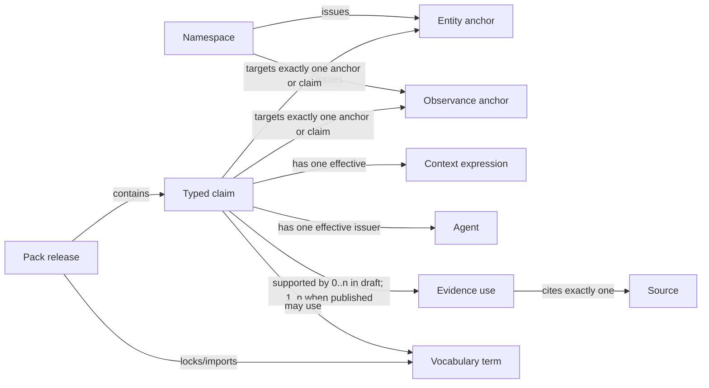

# Conceptual model contracts and cardinalities

Status: Phase 2 review draft. This document specifies semantic invariants and
cardinalities without committing to JSON, YAML, or database fields.

## Anchor-plus-claims model

Entities and observances are minimal identity anchors. Assigning an anchor says
that the namespace owner intends a stable referent that claims can discuss. It
does not say the referent is historically certain or universally received.

Names, entity participation, observance reception, dates, ranks, fasting, tone,
lections, classifications, and identity equivalence are claims. This resolves
the open question in the initial domain model: an observance is neither a giant
fact record nor only a transient claim. It is an anchor plus claims about its
recognition and attributes.

The two arrows from a claim in this conceptual diagram mean its target may be
an entity, observance, another supported anchor type, or—in narrowly defined
review/supersession families—another claim. Each individual claim has exactly
one primary target.

## Core record contracts

| Concept | Required conceptual content | Cardinality and invariant |
|---|---|---|
| Namespace | Stable ID, owner/steward responsibility, lifecycle policy | One or more responsible agents; identifier ownership cannot be inherited from pack order |
| Entity anchor | ID, entity-kind term, lifecycle state | Exactly one immutable record kind; zero or more claims |
| Observance anchor | ID, lifecycle state | Zero or more participation claims; zero subjects is valid for an unresolved or subjectless occasion |
| Claim | ID, family, one typed payload, target, issuer, context, lifecycle/review/mode semantics | Exactly one target and one effective issuer; exactly one effective context expression; published claims have at least one provenance basis |
| Context | Scope state plus zero or more typed dimensions | AND across dimensions; OR only within an explicitly set-valued dimension; missing dimension means unspecified |
| Agent | ID and agent-kind term | May hold zero or more separately sourced authority-role assignments |
| Authority-role assignment | Agent, role term, context, validity, evidence | Never inferred merely from pack or source name |
| Source | ID, source-kind term, sufficient citation identity | Mutable online sources require retrieval/version evidence when cited |
| Evidence use | One source or derivation activity, claim, responsibility, optional locator | Exactly one claim and one source/activity; locators are repeatable by using multiple evidence uses |
| Vocabulary | ID, owner, version, term set | Released vocabulary versions are immutable |
| Term | ID, vocabulary, lifecycle | Exactly one owning vocabulary; multilingual labels are claims or vocabulary label records, not identity |
| Pack release | Pack ID, release version, publisher, resources, effective rights | Exactly one publisher, one or more maintainers, one or more indexed resources |
| Lock | Input pack/schema/vocabulary/algorithm selections | Every selection is exact and hash-bound where bytes are available |

## Domain-specific anchor contracts

| Anchor | Relationships |
|---|---|
| Entity | Zero or more name, classification, relationship, status, and external-mapping claims; zero or more observance-participation claims may point to it |
| Observance | Zero or more name, participation, reception, date, rank, fasting, tone, lection-appointment, material-association, and external-mapping claims |
| Date rule | Reusable calendar-extension anchor; one rule family and explicit calendar/paschalion inputs where applicable |
| Lection | One or more ordered passage segments; zero or more appointment claims |
| Work | Zero or more expressions and subject/observance association claims |
| Expression | Exactly one work; language/recension/translation responsibility; zero or more editions |
| Edition | One or more expressions or an explicitly declared composite; zero or more assets |
| Asset | Exactly one effective rights statement; content may be included or reference-only |

An authoring profile may require at least one name or external mapping for a new
anchor so humans can review it. That is a quality rule, not the identity
semantics: incomplete imported anchors must remain representable.

## Claim envelope

Every claim family shares these conceptual fields:

- persistent claim ID;
- exactly one primary target;
- claim family and typed payload;
- exactly one effective issuer/responsible agent;
- exactly one effective context expression;
- claim mode;
- lifecycle state;
- review state;
- optional attributed certainty;
- applicability validity statement;
- one or more provenance bases when published;
- zero or more superseded/replaced claim references;
- pack/release editorial metadata.

### Claim mode

The initial core modes are:

- **prescription:** the responsible authority states what should apply;
- **attested usage:** a source or responsible observer records what was done;
- **descriptive report:** a source states a fact or classification without
  necessarily prescribing practice;
- **editorial interpretation:** an editor infers or reconciles a claim from
  evidence;
- **automated derivation:** a reproducible activity computes a result from
  identified inputs.

Mode does not determine priority. An engine or researcher may select different
policies, but the generic loader preserves every mode.

### Lifecycle, review, and certainty

These axes are independent:

| Axis | Core processing states | Meaning |
|---|---|---|
| Lifecycle | draft, published, superseded, withdrawn | Publication/replacement state of this claim record |
| Review | unreviewed, reviewed, disputed | Editorial process state |
| Mode | the five modes above | Kind of assertion or derivation |
| Certainty | optional term + source wording + assessor | Epistemic confidence, not a core numeric truth score |

`unknown` belongs in a domain value or certainty vocabulary when the source does
not know. It is not equivalent to unreviewed. A reviewed claim may be disputed;
a superseded claim remains citable.

OOLDS v0.1 will not add a universal positive/negative flag. Explicit denials use
typed domain values or relations such as `disjoint`, `not-received`, or
`rejected-by`. Missing data means only that no claim is present.

## Context semantics

Every normalized claim has a context expression with a `scope state`:

- **specified:** one or more dimensions constrain application;
- **unbounded assertion:** the issuer explicitly states no scope restriction;
- **unknown:** the available evidence does not establish scope.

“Unbounded assertion” records what the issuer claims; it does not mean the core
project certifies universality.

Initial context dimensions are:

| Dimension | Example referents | Notes |
|---|---|---|
| authority role | diocesan liturgical office acting as publisher | Separate from the agent and jurisdiction |
| tradition | Typikon lineage or liturgical family | Not interchangeable with ethnicity or jurisdiction |
| jurisdiction/community | church, diocese, monastery, parish | Organizational relationships are separately sourced and time-bounded |
| geography | place or region identity | Does not imply jurisdiction automatically |
| service/use | Matins Gospel, parish bulletin expression use | Service position uses vocabulary terms |
| language/expression | Greek expression, Church Slavonic recension | Language tag alone does not identify an edition |
| calendar | Julian, Gregorian, Revised Julian catalog entry | References a versioned definition |
| paschalion | named Paschal algorithm/profile | Never inferred only from fixed calendar |

Applicability time is modeled by validity rather than as another context
dimension. Extensions may add dimensions by identified vocabulary. Generic
consumers preserve unknown dimensions and must not interpret their absence as a
match-all wildcard.

Within one context, different present dimensions intersect. A set of values
inside one dimension means “any of these values.” More complex alternatives use
separate claims; this avoids ambiguous cross-products and keeps authoring
reviewable.

## Four independent timelines

1. **Claim validity:** when the proposition applies in its domain.
2. **Record lifecycle:** when this encoded claim was drafted, published,
   superseded, or withdrawn.
3. **Source coverage/publication:** the year, edition, or historical period the
   cited source represents.
4. **Evidence retrieval/activity:** when a mutable resource was accessed or a
   derivation ran.

Claim validity uses an inclusive start and exclusive end when precise bounds are
known. A missing interval means time is unspecified, not eternal. An issuer may
explicitly assert unbounded/perennial applicability. Uncertain or coarse
historical bounds preserve precision and source wording rather than inventing a
day.

Historical consumers state an `as-of` policy: claims valid at the historical
date, claims known by a publication cutoff, or both. OOLDS records the timelines
but does not choose that research policy.

## Provenance defaults and authoring economy

To keep hand authoring practical, a pack may declare named profiles for:

- responsible editor/issuer;
- rights default;
- source plus locator prefix;
- repeated context expression;
- review workflow metadata.

A claim references the profile explicitly. Normalization expands it so the
effective claim is self-contained. Directory names, file names, pack ordering,
and undocumented importer settings never supply semantics.

These values may not be inherited implicitly:

- claim target or family;
- contextual scope;
- validity;
- certainty;
- identity equivalence;
- a source locator that distinguishes one assertion from another.

A draft claim may have no external source, but it still has an effective
responsible agent. A published claim has at least one provenance basis: evidence
use, identified first-hand attestation, prescription issuance, or reproducible
derivation activity.

## Composition and conflicts

Pack composition is graph union plus validation, never last-write-wins.

Two claims potentially compete when they have the same target and claim family,
overlapping context and validity, and incompatible payloads. Competition is not
a conformance error. Validators report it with claim IDs and sources; consuming
policy decides whether to display, select, or resolve it.

Dependency conflicts are different: incompatible required versions, hash
mismatches, namespace-owner collisions, or unavailable vocabularies prevent a
reproducible load and are conformance errors.

Claims with identical payloads but different issuers remain separately
attributable. One issuer may consolidate multiple evidence uses into one claim,
but a pack must not merge another issuer's claim without preserving attribution
and derivation.

## Deliberately rejected alternatives

- **All properties directly on entity/observance records:** cannot preserve
  competing scope, evidence, or validity.
- **Everything as a generic triple:** structurally elegant but makes human
  authoring, validation, and domain diagnostics too weak.
- **Pack order as authority priority:** non-reproducible ecclesial policy hidden
  in a loader.
- **Missing context means universal:** turns incomplete imports into false
  universality.
- **One overloaded status:** conflates editorial review, publication lifecycle,
  certainty, and claim mode.
- **Every scalar wrapped in bespoke provenance:** correct in theory but hostile
  to contribution; named explicit profiles provide a lossless balance.
