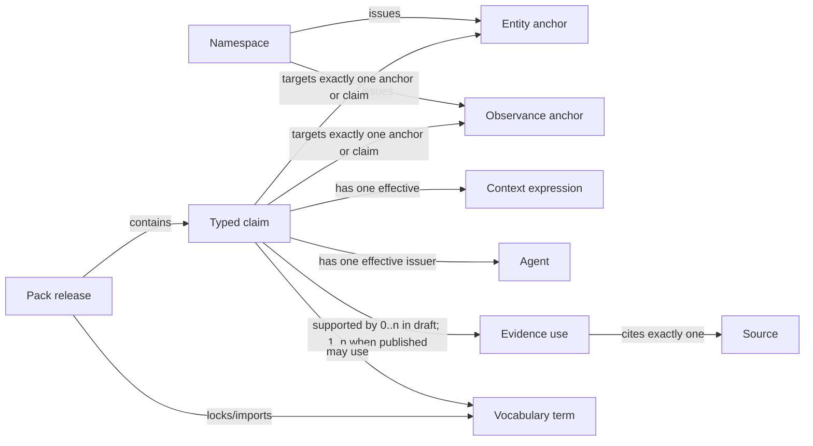

# Phase 2 external review packet

Status: ready for reviewer recruitment. This packet requests critique; it does
not ask reviewers to endorse OOLDS as an ecclesial authority.

## Review objective

Determine whether the proposed common language can represent Orthodox
liturgical identities and attributed variation without importing one
jurisdiction's ontology or a Typikon engine's decisions into the core.

The specific hypothesis is:

> Minimal entity and observance identity anchors plus typed, scoped,
> source-backed claims can preserve overlapping Orthodox datasets without
> forcing agreement about rank, date, reception, readings, historical identity,
> or authority.

## Reading order

1. [Vision](../../VISION.md) and [Principles](../../PRINCIPLES.md)
2. [Glossary](../GLOSSARY.md)
3. [Conceptual contracts](../MODEL-CONTRACTS.md)
4. [Identifier lifecycle](../IDENTITY-LIFECYCLE.md)
5. [Provenance](../PROVENANCE.md)
6. [Localization](../LOCALIZATION.md)
7. [Typikon boundary](../TYPIKON-BOUNDARY.md)
8. [Case dispositions](../CASE-DISPOSITIONS.md)
9. [Rights and licensing](../RIGHTS-AND-LICENSING.md)

The [prior-art report](../PRIOR-ART.md) provides evidence for the distinctions
but is not required for a first conceptual review.

## Decisions under review

- Entity and observance are minimal identity anchors.
- Recognition and attributes are typed claims with exactly one target, one
  effective issuer, and one effective context expression.
- Published claims require at least one provenance basis.
- Missing context or validity means unspecified, not universal or eternal.
- Claim mode, review, lifecycle, certainty, and validity are independent.
- Authority is an agent's sourced role in context, not a synonym for tradition
  or jurisdiction.
- Namespace owners govern their own redirects; cross-namespace identity remains
  mapped claims.
- Rank, calendar/paschalion, grammar, lection-reference, tone, and similar
  semantics use versioned vocabularies/extensions.
- Typikon resolution selects among claims but is not part of the interchange
  core.

## Questions for every reviewer

1. Which real case cannot be represented without loss or a misleading claim?
2. Which distinction is unnecessary or too burdensome for human editors?
3. Where does the model accidentally encode an ecclesiological conclusion?
4. Where could missing data be mistaken for universal agreement or denial?
5. Which term is misleading in Greek, Church Slavonic, Arabic, Russian,
   Romanian, Serbian, Georgian, or another liturgical context?
6. Does any identifier lifecycle step destroy a citable historical state?
7. Could a generic consumer parse the records without jurisdiction-specific
   branches?
8. What should be removed from v0.1?

## Perspective-specific review

### Clergy and liturgics

- Does observance identity remain meaningful across jurisdictions?
- Are forefeast, afterfeast, leave-taking, synaxis, dedication, translation,
  local reception, and annual transfer modeled without prejudging resolution?
- Are prescription and attested usage properly distinguished?
- Does the Typikon boundary leave enough data for a real resolver?

### Greek and Church Slavonic language/text specialists

- Are BCP 47, script, orthography, grammatical forms, and transliteration
  separated correctly?
- Does NFC normalization preserve the relevant distinctions when exact source
  assets are retained?
- Does name preference remain contextual rather than Anglocentric?
- Which language-specific features need early controlled vocabularies?

### Historians, librarians, and textual scholars

- Are person, collective, event, observance, work, expression, edition, asset,
  and witness boundaries defensible?
- Are uncertainty, source locators, mutable web states, identity mappings, and
  split/merge histories citable?
- Is the source/evidence/authority separation compatible with catalog practice?

### Pack/data maintainers

- Can repeated source/context metadata be authored through explicit profiles
  without dangerous hidden defaults?
- Can a namespace commit to the lifecycle rules?
- Are rights and dependency requirements feasible for offline releases?
- Which existing IDs can be mapped without relabeling the native corpus?

### Application and engine implementers

- Can the cardinalities map cleanly to files, relational tables, and graphs?
- Can unknown extensions round-trip?
- Are dependency errors distinguishable from valid claim conflicts?
- Can a calendar UI, research tool, and Typikon engine select context without
  the loader hard-coding OCA/GOARCH/Russian/Antiochian branches?

### Licensing review

- Does the multi-license category boundary remain clear in schemas, generated
  examples, and reference fixtures?
- Are CC0 factual records separable from authored descriptions and translations?
- Is the resource-level model sufficient for metadata-only restricted sources?

## Requested response format

```text
Reviewer perspective:
Materials reviewed:

Blocking issues:
- [document/section/case] issue, real example, and proposed correction

Non-blocking issues:
- ...

Missing adversarial cases:
- ...

Terminology concerns:
- ...

Verdict:
- ready for Phase 3 fixtures / revise and re-review / outside my scope
```

## Evidence standard for review comments

Whenever practical, provide a primary source, edition, official annual calendar,
service publication, schema/API record, or reproducible application behavior.
A reviewer may report confidential or pastoral knowledge, but the eventual
public decision must state what can be cited and what remains an unattributed
design caution.

## Exit checklist

Phase 2 cannot close until the repository records review from:

- at least two Orthodox jurisdictions or liturgical traditions;
- a clergy/liturgics reviewer familiar with collision and transfer;
- Greek and Church Slavonic textual/language expertise;
- library/archive or textual-scholarship expertise;
- two independent application or engine implementers;
- an appropriate licensing review.

For each blocking issue, maintainers will record an accepted correction,
documented deferral with loss analysis, or reasoned rejection. Reviewer silence
does not count as consensus.

Actual reviews and dispositions are tracked in the [review
log](REVIEW-LOG.md).

# Phase 2 glossary

Status: review draft. These definitions constrain the conceptual model but are
not yet normative schema language.

The definition tests below are intentionally stricter than ordinary application
usage. A producer may call a day card a “saint,” but OOLDS must still determine
whether the record identifies a person, an observance, a dated occurrence, or a
presentation assembled from all three.

## Identity and assertion terms

### Identity anchor

A persistent identifier assigned by a namespace owner to a hypothesized
referent so other records can discuss it over time. The anchor asserts only that
the issuer intends references to co-refer; it does not assert universal
recognition, historicity, ecclesial reception, or agreement about attributes.

An anchor is necessary when claims about the referent can change or disagree
without changing what those claims are about.

> **Example:** A record keeps the identifier `example:person:nicholas`
> even when editors change its preferred spelling or disagree about a birth date. The
> identifier holds the discussion together; the changing details remain claims.

### Entity

An identity anchor for a person, collective, event, material object, place,
institution, or other subject that can participate in relationships and can be
the subject of one or more observances.

**Distinguishing test:** if two commemorations can concern the same referent,
the referent is an entity and the commemorations are separate observances.

An entity is not a name, biography, feast-day row, hagiographic work, or
presumption of historical certainty.

> **Example:** Nicholas of Myra is represented once as a person entity.
> His repose commemoration and the translation of his relics are separate observances
> that can both point to that same person.

### Observance

An identity anchor for a distinguishable liturgical commemoration or occasion
that can receive its own names, date rules, ranks, lection appointments,
relationships, reception claims, and service-material associations.

**Distinguishing test:** if two occasions can have different date, rank,
reading, reception, or service claims while concerning the same subject, they
are distinct observances.

An observance may concern zero, one, or many entities. It is not a generated
civil date, an assembled service, or an assertion that every community receives
the occasion.

> **Example:** The December commemoration of Nicholas and the May
> translation-of-relics commemoration can have different readings and ranks, so each
> receives its own observance identifier even though both concern Nicholas.

### Occurrence

A dated projection of an observance or cycle under named calendar, paschalion,
liturgical-day, engine, policy, and pack-lock inputs.

An occurrence is derived output or a dated witness. It never replaces the
standing observance or date-rule claim.

> **Example:** A December 6 observance under the Julian calendar projects
> to December 19 on the 2026 Gregorian civil calendar. That dated December 19 item is an
> occurrence, not a replacement for the standing observance.

### Claim

An identifiable, attributable proposition about a target. A claim has a typed
payload and can be supported, disputed, superseded, scoped, or temporally
limited without mutating the target's identity.

**Distinguishing test:** if another responsible party could coherently assert a
different value, scope, validity, or interpretation, the information belongs in
a claim rather than the identity anchor.

OOLDS uses typed claims, not unrestricted subject/predicate/object triples. A
name claim, rank claim, participation claim, and lection-appointment claim share
an envelope but have domain-specific payloads and validation.

> **Example:** One pack can claim that an observance has a particular
> rank in one diocese while another pack claims a different rank in another context.
> Both propositions remain separately identified and attributed.

### Claim family

The semantic kind of proposition and its typed payload contract—for example
name, participation, date assignment, rank, fasting, tone, lection appointment,
classification, reception, or identity mapping.

> **Example:** A name claim carries a language-tagged string, while a
> rank claim carries a term from a rank vocabulary. They share the claim envelope, but
> each family validates a different payload.

### Claim mode

What kind of speech act or derivation a claim represents: prescription,
attested usage, descriptive source report, editorial interpretation, or
automated derivation. Mode is independent of review state and certainty.

> **Example:** A diocesan directive saying what parishes should do is a
> prescription. A parish calendar recording what that parish actually did is attested
> usage, even if the two claims describe the same date.

### Context

An explicit expression limiting where or for whom a claim applies. Common
dimensions include authority role, tradition, jurisdiction/community,
geography, service/use, language/expression, calendar, and paschalion.

An absent value means unspecified, not universal. Context is distinct from the
agent who issued the claim and from the source used as evidence.

> **Example:** A Gospel appointment may apply only in a named diocese, at
> Matins, during a stated period. Leaving the diocese unspecified would mean that the
> scope is unknown, not that every Orthodox community uses it.

### Validity

The interval or temporal statement describing when a claim applies in its
domain. Validity is distinct from when a record was authored, a source was
published, a webpage was retrieved, or a calculation was performed.

> **Example:** A rank claim may apply from 2010 through 2018 even if an
> editor enters the record in 2026 from a book published in 2020. Those three dates
> answer different questions.

### Review state

Editorial process metadata such as unreviewed, reviewed, or disputed. Review
does not transform a local claim into a universal fact.

> **Example:** A reviewer can confirm that a manuscript was transcribed
> accurately while marking the editor's identification of the commemorated person as
> disputed. Review records process, not universal truth.

### Certainty

An attributed assessment of epistemic confidence. Certainty may preserve a
source's own wording and vocabulary. It is independent of review state: a claim
can be carefully reviewed and still genuinely uncertain.

> **Example:** An editor may carefully review a source that says two
> saints are 'possibly the same person.' The resulting mapping can be reviewed yet
> retain the source's genuine uncertainty.

## Provenance and responsibility terms

### Agent

A person, organization, community, or software process that bears
responsibility for a claim, source, publication, mapping, derivation, or review.
This follows the useful responsibility distinction in
[PROV-O](https://www.w3.org/TR/prov-o/) without requiring RDF.

> **Example:** A monastery editor can be the agent responsible for a name
> claim, while a calendar engine is the agent responsible for a calculated occurrence.
> Both are agents because each bears responsibility for an action or assertion.

### Authority role

A sourced and time-bounded relationship in which an agent acts with a stated
capacity within a context. “Publisher,” “diocesan liturgical authority,”
“translator,” and “editor” are different roles.

Authority is not a synonym for jurisdiction, tradition, source, or truth. The
core model records the claimed role without deciding ecclesiological questions.

> **Example:** Maria may act as translator for one edition and as editor
> for another. Recording those two scoped roles avoids treating 'Maria' as permanently
> or universally authoritative in either capacity.

### Source

An identifiable resource consulted or cited: publication, manuscript, decree,
calendar, database release, webpage, API response, correspondence, or another
witness.

A source is not automatically authoritative, and its publisher is not
automatically the issuer of every claim extracted from it.

> **Example:** A printed 2026 diocesan calendar is one source, while its
> later corrected web edition is another identifiable source state. The calendar's
> publisher is not automatically the issuer of every editorial claim extracted from it.

### Evidence use

The qualified link from a claim to a source or derivation activity, including a
locator, retrieval information where needed, extraction method, and responsible
agent.

The same source can support different claims at different locators, and the same
claim can cite several evidence uses.

> **Example:** A rank claim can cite page 42, row 3 of a calendar, record
> that Jon transcribed it, and preserve the page image hash. A second claim from page 87
> creates a second evidence use.

### Witness

A source or source record that attests a concrete historical or annual outcome,
such as a published 2026 calendar. A witness may support an inference about a
standing rule, but it is not automatically that rule.

> **Example:** A 2026 calendar showing that a feast was transferred to
> Monday witnesses what happened that year. It does not by itself prove that the same
> transfer is a permanent rule.

### Derivation activity

An identified transformation or computation that uses input claims/resources
and produces another claim or projection. It records tool/engine version,
policy, time, and inputs as appropriate.

> **Example:** Engine version 1.4 uses a named date rule, a locked
> calendar definition, and a specific pack release to calculate a 2027 occurrence. The
> recorded run makes that result reproducible.

## Language and text terms

### Name claim

A claim that a target is called by a particular Unicode string in a declared
language, orthographic, grammatical, transliteration, and usage context.

There is no globally preferred name. Preference is a scoped usage claim.

> **Example:** A person can have a Greek liturgical name, a Church
> Slavonic grammatical form, and an English short name. Each string is its own sourced,
> language-tagged name claim rather than a field in one language map.

### Work

An identity anchor for an intellectual or liturgical work independent of a
particular language, translation, edition, or file.

> **Example:** The Canon to Saint Nicholas is one work even when it
> survives in Greek, Church Slavonic, and English. The abstract work is not any single
> translation or scan.

### Expression

A language-, recension-, translation-, arrangement-, or notation-specific
realization of a work.

> **Example:** A Church Slavonic translation of the Canon to Saint
> Nicholas is an expression of that work. A revised English translation is a different
> expression even if both appear in the same book.

### Edition

An edited or published realization of one or more expressions with stated
responsibility, version, and source history.

> **Example:** A 1998 printed service book that edits and publishes
> particular Greek and English expressions is an edition. A 2007 corrected printing can
> be represented as another edition.

### Asset

A concrete file, byte stream, API representation, or externally hosted media
object with media type, location, integrity metadata where available, and its
own rights.

> **Example:** The PDF scan of the 1998 edition is an asset with a file
> hash, media type, location, and rights record. Its bytes are distinct from the edition
> and from the work it contains.

### Lection

A liturgical reading identity consisting of one or more ordered scriptural
passage references under declared reference-system and versification semantics.
It is independent of any Bible translation text.

> **Example:** A lection can identify Hebrews 13:17-21 followed by Luke
> 6:17-23 as ordered references. Greek, Church Slavonic, and English Bible text files
> remain separate expression assets.

### Appointment claim

A claim that a lection is appointed for an observance, cycle, service, or
service position in a stated context and validity period.

> **Example:** A diocese may appoint a particular lection to an
> observance at Divine Liturgy for 2026. The lection identity stays stable while the
> appointment's context and validity belong to the claim.

## Federation and packaging terms

### Namespace

An identifier space governed by a declared owner/steward. A namespace controls
the lifecycle of identifiers it issues. Other parties may publish mapping
claims but cannot redirect someone else's identifier.

> **Example:** A monastery can govern identifiers beginning with
> `monastery.example:`. Another pack may map one of those IDs to its own record, but
> only the monastery's namespace steward can redirect the original identifier.

### External identifier

An identifier issued by another system and attached through a typed mapping.
BHG/work identifiers, Pinakes records, Wikidata items, Ponomar IDs, and
application database IDs remain distinguishable by issuer and object kind.

> **Example:** An OOLDS person record may carry a typed mapping to a
> Wikidata item and a separate mapping to a local archive ID. The issuer and expected
> object kind remain visible for each identifier.

### Identity mapping

A claim relating two identifiers with a typed relation such as exact, close,
possible, broader, narrower, supersedes, or disjoint. OOLDS borrows the useful
distinction between exact and close mappings from
[SKOS](https://www.w3.org/TR/skos-reference) but does not inherit SKOS
transitivity automatically for real-world identity.

> **Example:** An editor may assert that two records are a close match
> because their names and dates agree but the evidence is incomplete. Another editor can
> publish a disjoint mapping without either assertion silently overwriting the other.

### Vocabulary

An identified, versioned concept scheme published by an owner. Rank schemes,
entity kinds, participation roles, calendars, paschalions, canons, and
versifications are vocabularies or algorithm catalogs, not English enums in the
core schema.

> **Example:** A jurisdiction can publish version 2 of its rank scheme as
> a vocabulary. Applications refer to that identified scheme instead of assuming that
> every dataset's value `3` means the same rank.

### Term

A persistent member of a vocabulary. Its identifier is stable; its labels and
definitions can be multilingual and versioned.

> **Example:** A rank term keeps one stable ID while gaining Greek and
> English labels in a later vocabulary release. Changing a label does not create a new
> term identity.

### Pack

A logical independently maintained dataset with a stable identity, declared
scope, namespaces, dependencies, maintainers, and rights.

> **Example:** A monastery calendar pack can declare its namespace,
> maintainers, date-rule dependency, and rights while remaining independently usable.
> Its identity continues across multiple releases.

### Pack release

An immutable version of a pack with a resource index and cryptographic hashes.

> **Example:** Version 1.2.0 of a calendar pack lists exact resource
> hashes and never changes after publication. A correction is published as version 1.2.1
> rather than altering 1.2.0.

### Lock

A reproducibility record selecting exact pack, vocabulary, algorithm, and
schema versions and hashes. A lock contains no unversioned “latest” reference.

> **Example:** A lock can select calendar pack 1.2.0, rank vocabulary
> 2.1, paschalion profile 3.0, and their hashes. Reopening that lock years later avoids
> silently using newer releases.

### Projection

Derived dated or ordered output, such as a civil calendar, iCalendar feed, or
service plan, accompanied by sufficient input and engine trace to reproduce it.

> **Example:** A 2027 iCalendar feed generated from a named lock and
> engine version is a projection. Its trace lets another tool reproduce the dates
> without treating the feed as the underlying rules.

## Terms that must not be silently collapsed

| Keep distinct | Reason |
|---|---|
| Entity / observance / occurrence | Subject, recurring occasion, and dated projection have different identity |
| Claim / source / evidence use | Proposition, cited resource, and qualified citation are different things |
| Agent / authority role / jurisdiction / tradition | Responsibility, capacity, governance scope, and liturgical lineage are different dimensions |
| Work / expression / edition / asset | Intellectual identity, realization, publication, and bytes have different provenance and rights |
| Rank term / descriptive feature / engine consequence | Similar labels do not prove cross-tradition equivalence or precedence |
| Date rule / annual witness / civil projection | Standing pattern, attested outcome, and calculation are not interchangeable |
| Review state / certainty / claim mode / lifecycle | Editorial process, confidence, speech act, and publication status answer different questions |
| Missing claim / explicit denial | Absence of data is not a negative ecclesial or historical assertion |

> **Example:** A parish app may display one row labeled 'Saint Nicholas -
> December 6,' but exchange data still separates the Nicholas person, the recurring
> observance, its 2026 occurrence, the rank claim, the calendar source, and the evidence
> locator.

# Vision

## The problem

Orthodox calendars and service applications repeatedly encode the same people,
feasts, readings, ranks, calendar rules, and names. Their records are rarely
portable because each application also embeds local assumptions: a particular
jurisdiction, calendar reckoning, language, rank scale, Bible versification,
Typikon, source corpus, and sometimes copyrighted prose.

The hard problem is not producing one more calendar feed. It is exchanging the
evidence and claims from which different calendars can be produced while
preserving real ecclesial and scholarly disagreement.

For example, one saint may have a repose commemoration, a translation-of-relics
commemoration, and a local synaxis. These are not duplicate people and they are
not interchangeable feast records. A rank or lection attached to one observance
may be authoritative only for a particular church, edition, place, or period.
A civil date is a projection of a liturgical rule through a calendar and year,
not necessarily the rule itself.

> **Example:** Two calendar applications may both display 'Saint
> Nicholas' yet mean different observances, use different civil dates, and cite
> different rank schemes. Exchanging only the finished display row loses every one of
> those distinctions.

## Proposed mission

OOLDS will define a small, extensible, implementation-neutral way to exchange:

- persistent identities and explicit cross-system mappings;
- observances distinct from the subjects they commemorate;
- scoped, source-backed claims rather than unqualified universal facts;
- recurring date rules and lection appointments without embedding a complete
  rubrical engine;
- multilingual and multiscript names without treating English as canonical;
- works, expressions, editions, and assets with rights at the correct level;
- versioned, verifiable packs that work offline and compose predictably.

> **Example:** A monastery can publish a pack containing stable IDs,
> sourced date and rank claims, multilingual names, and a lock. A parish application can
> consume it without adopting the monastery's database schema or rubrical engine.

## Intended users

- Orthodox calendar, lectionary, service-planning, publishing, and chanting
  applications;
- dioceses, parishes, monasteries, seminaries, libraries, and archives;
- editors maintaining calendar, hagiographic, hymnographic, or scriptural data;
- researchers reconciling persons, observances, texts, manuscripts, and
  historical witnesses;
- engine authors who need neutral inputs without adopting a single project's
  database model.

> **Example:** An archive can contribute source identities and page-level
> evidence, while a parish application consumes those records and selects the claims
> appropriate to its community. Neither side must use the other's internal software
> model.

## Success for v0.1

Version 0.1 should be considered successful when two independently maintained
packs can be combined offline and a conforming tool can:

1. distinguish a person or other subject from each observance concerning it;
2. retain conflicting rank, date, naming, or lection claims with their scopes;
3. identify the calendar and paschalion assumptions of each date rule;
4. round-trip multilingual names, including Church Slavonic and polytonic
   Greek, without lossy normalization;
5. exchange ordered composite lections without bundling a Bible translation;
6. report where each material claim came from and what reuse rights apply;
7. detect namespace, dependency, checksum, and compatibility failures before
   resolution;
8. hand unresolved data to more than one Typikon engine without making either
   engine's service plan normative.

> **Example:** Two offline packs can disagree about a rank, combine
> without overwriting either claim, and let a validator report the disagreement
> alongside each source and context before an engine applies local policy.

## Non-goals

OOLDS will not, in its core specification:

- define a universal Orthodox calendar, rank ladder, fasting code, or Typikon;
- declare one jurisdiction's practice the default for all consumers;
- settle disputed identity, historicity, reception, or ecclesial authority;
- assemble services or choose precedence when observances collide;
- provide a full hymnographic, hagiographic, musical, or biblical text format;
- redistribute source material whose permissions do not permit it;
- require network access, a central resolver, RDF storage, or a particular
  programming language;
- make application presentation objects into canonical domain records.

> **Example:** If two traditions resolve the same fasting collision
> differently, OOLDS preserves both inputs and their provenance. It does not declare
> which resulting meal rule is universally correct.

## Relationship to existing systems

OOLDS should be a translation boundary, not a replacement campaign. Ponomar,
Orthocal, Digital Chant Stand, Ispovednik, typikon-engine, and future systems
should be able to publish mappings or packs while retaining their native
models. Existing identifiers should remain visible as typed external
identifiers. No migration should require an editor to renumber a mature local
corpus.

> **Example:** A mature Ponomar record can retain its original ID while
> an OOLDS pack publishes a typed mapping to it. Editors do not need to renumber the
> Ponomar database to participate.

## Long-term shape

The likely mature project is a family of small specifications rather than one
monolith:

- a core identity and assertion model;
- calendar-rule and lection extensions;
- text-catalog and fine-grained annotation profiles;
- an offline pack and lockfile format;
- validation rules and conformance fixtures;
- optional registries and mappings maintained by communities with declared
  governance.

This shape remains a hypothesis until the domain model has passed the
adversarial cases and public review.

> **Example:** A small core can define anchors and claims, a lection
> extension can define ordered passages, and an offline-pack specification can define
> locks. A consumer implements only the pieces it needs.

# Design principles

These principles are proposed constraints for the model and its governance.
Changing one should require a recorded design decision and evidence from real
data.

1. **Distinguish subjects, observances, claims, evidence, and outputs.** A saint
   is not a feast; a feast is not a dated calendar occurrence; a source is not
   the claim derived from it; an engine result is not the source record.

> **Example:** A screen may show one row for 'Saint Nicholas - December
> 6,' while the data keeps the Nicholas person, the observance, its 2026 occurrence, the
> rank claim, and the supporting calendar source separate.

2. **Preserve disagreement.** Conflicting claims may both be valid within their
   stated contexts. Combining packs must not silently overwrite a lower-priority
   record or manufacture consensus.

> **Example:** A Greek pack and a Slavic pack can assign different ranks
> to the same observance. Combining them retains both attributed claims instead of
> allowing the last imported file to win.

3. **Model who says what, where, when, and on what evidence.** Authority,
   jurisdiction, tradition, locale, edition, time validity, source, and review
   status are different dimensions.

> **Example:** A reading appointment records the diocesan office that
> issued it, the diocese and service where it applies, its validity period, the
> service-book page that supports it, and its review status.

4. **Keep identity stable and content versioned.** Object identifiers are never
   reused or changed because a preferred label changes. Packs and records can be
   versioned independently. Merges and splits remain auditable.

> **Example:** The identifier for Nicholas of Myra remains stable when an
> English label changes. If two duplicate IDs merge, redirects and historical claim
> targets remain visible in old releases.

5. **Federate namespaces.** A central OOLDS namespace may be convenient, but
   interoperability must not depend on a central service or one institution's
   identifier assignments.

> **Example:** A monastery and a seminary can issue IDs in their own
> namespaces and exchange mapping claims offline. Neither must ask a central registry
> for permission to create records.

6. **Treat equivalence as an assertion.** External mappings, redirects, close
   matches, and disputed identifications carry an issuer, evidence, and status.
   A `sameAs` link is not harmless metadata.

> **Example:** Two editors can publish exact-match and possible-match
> claims about the same pair of IDs, each with evidence and certainty. Software does not
> collapse them into an unqualified `sameAs` fact.

7. **Make hidden assumptions explicit.** Calendar reckoning, paschalion,
   versification, rank scheme, language, script, transliteration system, and
   vocabulary owner must never be inferred from an English label or pack name.

> **Example:** A date rule names the Julian calendar and a specific
> paschalion profile. A value called 'major' also names its rank vocabulary rather than
> relying on an English word.

8. **Do not make English the ontology.** Machine identifiers are
   language-neutral. Labels are repeatable language-tagged expressions, and
   multiple preferred forms can coexist in different contexts.

> **Example:** Greek, Church Slavonic, Arabic, and English labels all
> point to language-neutral IDs. Separate communities can prefer different English forms
> without making either the ontology label.

9. **Prefer references over copied prose.** Lection appointments point to
   ordered passages in an explicit reference system. Text, translation, audio,
   notation, and images are separately identified assets with separate rights.

> **Example:** A lection appointment stores ordered passage references,
> while a copyrighted English Bible passage remains a separately licensed asset or an
> external reference.

10. **Put rights where the content lives.** Repository visibility and a code
    license do not establish permission to redistribute every fixture, text,
    translation, icon, or recording in it.

> **Example:** Putting an icon file in an Apache-licensed repository does
> not grant Apache rights to the icon. The asset carries its own rights holder,
> permission, and redistribution status.

11. **Work offline first.** A pack is self-describing, versioned, checksumable,
    and resolvable without a network. Online registries and content negotiation
    are optional conveniences.

> **Example:** A downloaded pack contains its namespace definitions,
> exact dependencies, and hashes, so a parish laptop can validate and use it with no
> registry connection.

12. **Keep the core small.** Put cross-domain identity and assertion mechanics
    in the core; specialized text, manuscript, music, or rubrical semantics
    belong in profiles, extension schemas, or controlled vocabularies.

> **Example:** The core records identity, claims, context, and
> provenance; a music extension defines mode-specific notation, and a calendar extension
> defines date-rule payloads.

13. **Separate structural and semantic validation.** A schema can validate
    shapes and datatypes. Cross-record identity, dependency closure, calendar
    semantics, vocabulary ownership, and rights completeness require additional
    conformance rules.

> **Example:** JSON Schema can confirm that a claim has an ID and date
> string, while semantic validation checks that its namespace owner, vocabulary version,
> dependency lock, and rights are coherent.

14. **Make simple contributions simple.** A contributor should be able to add a
    sourced name or mapping without understanding every advanced feature.
    Complexity belongs in optional fields and tooling, not hidden defaults.

> **Example:** To add one sourced English name, a contributor selects a
> target, enters the name, and references a reusable source/context profile. Advanced
> provenance fields expand during normalization.

15. **Stabilize semantics before syntax.** No JSON, YAML, JSON-LD, or database
    representation becomes normative until the concepts and loss tests are
    agreed.

> **Example:** Reviewers first agree that context, validity, and evidence
> are distinct. Only afterward does the project decide whether those concepts become
> JSON properties, YAML keys, or database tables.

# Conceptual model contracts and cardinalities

Status: Phase 2 review draft. This document specifies semantic invariants and
cardinalities without committing to JSON, YAML, or database fields.

## Anchor-plus-claims model

Entities and observances are minimal identity anchors. Assigning an anchor says
that the namespace owner intends a stable referent that claims can discuss. It
does not say the referent is historically certain or universally received.

Names, entity participation, observance reception, dates, ranks, fasting, tone,
lections, classifications, and identity equivalence are claims. This resolves
the open question in the initial domain model: an observance is neither a giant
fact record nor only a transient claim. It is an anchor plus claims about its
recognition and attributes.



The two arrows from a claim in this conceptual diagram mean its target may be
an entity, observance, another supported anchor type, or—in narrowly defined
review/supersession families—another claim. Each individual claim has exactly
one primary target.

> **Example:** The person Nicholas has one stable entity anchor. Separate
> claims provide his names, relationships, and disputed historical details, while two
> observance anchors represent his repose and relic-translation commemorations.

## Core record contracts

| Concept | Required conceptual content | Cardinality and invariant |
|---|---|---|
| Namespace | Stable ID, owner/steward responsibility, lifecycle policy | One or more responsible agents; identifier ownership cannot be inherited from pack order |
| Entity anchor | ID, entity-kind term, lifecycle state | Exactly one immutable record kind; zero or more claims |
| Observance anchor | ID, lifecycle state | Zero or more participation claims; zero subjects is valid for an unresolved or subjectless occasion |
| Claim | ID, family, one typed payload, target, issuer, context, lifecycle/review/mode semantics | Exactly one target and one effective issuer; exactly one effective context expression; published claims have at least one provenance basis |
| Context | Scope state plus zero or more typed dimensions | AND across dimensions; OR only within an explicitly set-valued dimension; missing dimension means unspecified |
| Agent | ID and agent-kind term | May hold zero or more separately sourced authority-role assignments |
| Authority-role assignment | Agent, role term, context, validity, evidence | Never inferred merely from pack or source name |
| Source | ID, source-kind term, sufficient citation identity | Mutable online sources require retrieval/version evidence when cited |
| Evidence use | One source or derivation activity, claim, responsibility, optional locator | Exactly one claim and one source/activity; locators are repeatable by using multiple evidence uses |
| Vocabulary | ID, owner, version, term set | Released vocabulary versions are immutable |
| Term | ID, vocabulary, lifecycle | Exactly one owning vocabulary; multilingual labels are claims or vocabulary label records, not identity |
| Pack release | Pack ID, release version, publisher, resources, effective rights | Exactly one publisher, one or more maintainers, one or more indexed resources |
| Lock | Input pack/schema/vocabulary/algorithm selections | Every selection is exact and hash-bound where bytes are available |

> **Example:** A published rank claim has its own ID, one observance
> target, one issuer, one explicit context, and at least one evidence use. The
> containing pack release identifies its publisher and hashes the resource that carries
> the claim.

## Domain-specific anchor contracts

| Anchor | Relationships |
|---|---|
| Entity | Zero or more name, classification, relationship, status, and external-mapping claims; zero or more observance-participation claims may point to it |
| Observance | Zero or more name, participation, reception, date, rank, fasting, tone, lection-appointment, material-association, and external-mapping claims |
| Date rule | Reusable calendar-extension anchor; one rule family and explicit calendar/paschalion inputs where applicable |
| Lection | One or more ordered passage segments; zero or more appointment claims |
| Work | Zero or more expressions and subject/observance association claims |
| Expression | Exactly one work; language/recension/translation responsibility; zero or more editions |
| Edition | One or more expressions or an explicitly declared composite; zero or more assets |
| Asset | Exactly one effective rights statement; content may be included or reference-only |

An authoring profile may require at least one name or external mapping for a new
anchor so humans can review it. That is a quality rule, not the identity
semantics: incomplete imported anchors must remain representable.

> **Example:** A hymn exists as a work; its Church Slavonic translation
> is an expression; a 1998 service book is an edition; and the scanned PDF is an asset
> with its own rights. The links preserve what changed at each level.

## Claim envelope

Every claim family shares these conceptual fields:

- persistent claim ID;
- exactly one primary target;
- claim family and typed payload;
- exactly one effective issuer/responsible agent;
- exactly one effective context expression;
- claim mode;
- lifecycle state;
- review state;
- optional attributed certainty;
- applicability validity statement;
- one or more provenance bases when published;
- zero or more superseded/replaced claim references;
- pack/release editorial metadata.

### Claim mode

The initial core modes are:

- **prescription:** the responsible authority states what should apply;
- **attested usage:** a source or responsible observer records what was done;
- **descriptive report:** a source states a fact or classification without
  necessarily prescribing practice;
- **editorial interpretation:** an editor infers or reconciles a claim from
  evidence;
- **automated derivation:** a reproducible activity computes a result from
  identified inputs.

Mode does not determine priority. An engine or researcher may select different
policies, but the generic loader preserves every mode.

> **Example:** A bishop's decree appointing a reading is prescription; a
> parish log showing another reading was actually used is attested usage; an editor
> explaining the difference is editorial interpretation. None automatically erases the
> others.

### Lifecycle, review, and certainty

These axes are independent:

| Axis | Core processing states | Meaning |
|---|---|---|
| Lifecycle | draft, published, superseded, withdrawn | Publication/replacement state of this claim record |
| Review | unreviewed, reviewed, disputed | Editorial process state |
| Mode | the five modes above | Kind of assertion or derivation |
| Certainty | optional term + source wording + assessor | Epistemic confidence, not a core numeric truth score |

`unknown` belongs in a domain value or certainty vocabulary when the source does
not know. It is not equivalent to unreviewed. A reviewed claim may be disputed;
a superseded claim remains citable.

OOLDS v0.1 will not add a universal positive/negative flag. Explicit denials use
typed domain values or relations such as `disjoint`, `not-received`, or
`rejected-by`. Missing data means only that no claim is present.

> **Example:** A published and reviewed mapping can still be marked
> uncertain. If better evidence appears, a new reviewed claim supersedes it while the
> older published claim remains citable.

> **Example:** Claim `example:claim:rank-17` targets one observance, uses
> the rank family, names a diocesan office as issuer, limits scope to that diocese,
> states prescription mode and 2020-onward validity, and cites page 14 of a decree.

## Context semantics

Every normalized claim has a context expression with a `scope state`:

- **specified:** one or more dimensions constrain application;
- **unbounded assertion:** the issuer explicitly states no scope restriction;
- **unknown:** the available evidence does not establish scope.

“Unbounded assertion” records what the issuer claims; it does not mean the core
project certifies universality.

Initial context dimensions are:

| Dimension | Example referents | Notes |
|---|---|---|
| authority role | diocesan liturgical office acting as publisher | Separate from the agent and jurisdiction |
| tradition | Typikon lineage or liturgical family | Not interchangeable with ethnicity or jurisdiction |
| jurisdiction/community | church, diocese, monastery, parish | Organizational relationships are separately sourced and time-bounded |
| geography | place or region identity | Does not imply jurisdiction automatically |
| service/use | Matins Gospel, parish bulletin expression use | Service position uses vocabulary terms |
| language/expression | Greek expression, Church Slavonic recension | Language tag alone does not identify an edition |
| calendar | Julian, Gregorian, Revised Julian catalog entry | References a versioned definition |
| paschalion | named Paschal algorithm/profile | Never inferred only from fixed calendar |

Applicability time is modeled by validity rather than as another context
dimension. Extensions may add dimensions by identified vocabulary. Generic
consumers preserve unknown dimensions and must not interpret their absence as a
match-all wildcard.

Within one context, different present dimensions intersect. A set of values
inside one dimension means “any of these values.” More complex alternatives use
separate claims; this avoids ambiguous cross-products and keeps authoring
reviewable.

> **Example:** A name preference scoped to English, one diocese, and
> parish bulletins applies only where all three dimensions match. Two allowed bulletin
> uses can share one dimension, but an alternative diocese requires a separate claim.

## Four independent timelines

1. **Claim validity:** when the proposition applies in its domain.
2. **Record lifecycle:** when this encoded claim was drafted, published,
   superseded, or withdrawn.
3. **Source coverage/publication:** the year, edition, or historical period the
   cited source represents.
4. **Evidence retrieval/activity:** when a mutable resource was accessed or a
   derivation ran.

Claim validity uses an inclusive start and exclusive end when precise bounds are
known. A missing interval means time is unspecified, not eternal. An issuer may
explicitly assert unbounded/perennial applicability. Uncertain or coarse
historical bounds preserve precision and source wording rather than inventing a
day.

Historical consumers state an `as-of` policy: claims valid at the historical
date, claims known by a publication cutoff, or both. OOLDS records the timelines
but does not choose that research policy.

> **Example:** A rank may be valid from 2010 to 2018, described in a 2015
> book, encoded in a 2024 pack release, and retrieved from a website in 2026. A
> historical query chooses which of those dates matters.

## Provenance defaults and authoring economy

To keep hand authoring practical, a pack may declare named profiles for:

- responsible editor/issuer;
- rights default;
- source plus locator prefix;
- repeated context expression;
- review workflow metadata.

A claim references the profile explicitly. Normalization expands it so the
effective claim is self-contained. Directory names, file names, pack ordering,
and undocumented importer settings never supply semantics.

These values may not be inherited implicitly:

- claim target or family;
- contextual scope;
- validity;
- certainty;
- identity equivalence;
- a source locator that distinguishes one assertion from another.

A draft claim may have no external source, but it still has an effective
responsible agent. A published claim has at least one provenance basis: evidence
use, identified first-hand attestation, prescription issuance, or reproducible
derivation activity.

> **Example:** Fifty claims can explicitly reference a profile naming the
> same editor, source edition, and diocesan context. Each claim still supplies its own
> target, family, validity, and page locator.

## Composition and conflicts

Pack composition is graph union plus validation, never last-write-wins.

Two claims potentially compete when they have the same target and claim family,
overlapping context and validity, and incompatible payloads. Competition is not
a conformance error. Validators report it with claim IDs and sources; consuming
policy decides whether to display, select, or resolve it.

Dependency conflicts are different: incompatible required versions, hash
mismatches, namespace-owner collisions, or unavailable vocabularies prevent a
reproducible load and are conformance errors.

Claims with identical payloads but different issuers remain separately
attributable. One issuer may consolidate multiple evidence uses into one claim,
but a pack must not merge another issuer's claim without preserving attribution
and derivation.

> **Example:** Pack A and Pack B assign incompatible ranks to the same
> observance in overlapping contexts, so both claims load and a validator reports
> competition. If Pack B's locked hash is wrong, composition stops before any ecclesial
> choice is attempted.

## Deliberately rejected alternatives

- **All properties directly on entity/observance records:** cannot preserve
  competing scope, evidence, or validity.
- **Everything as a generic triple:** structurally elegant but makes human
  authoring, validation, and domain diagnostics too weak.
- **Pack order as authority priority:** non-reproducible ecclesial policy hidden
  in a loader.
- **Missing context means universal:** turns incomplete imports into false
  universality.
- **One overloaded status:** conflates editorial review, publication lifecycle,
  certainty, and claim mode.
- **Every scalar wrapped in bespoke provenance:** correct in theory but hostile
  to contribution; named explicit profiles provide a lossless balance.

> **Example:** With last-write-wins, loading a Greek pack after a Slavic
> pack could silently erase the Slavic rank claim. Keeping both attributed claims makes
> the disagreement visible and reproducible.

# Identifier and identity lifecycle

Status: Phase 2 review draft. This document defines issuer and lifecycle
semantics; the exact character-level identifier grammar remains a Phase 4
specification decision.

## Goals

An OOLDS identifier must remain usable when:

- a preferred name or spelling changes;
- an observance date or rank claim changes;
- two independently maintained packs map overlapping referents;
- a record is merged, split, deprecated, or found uncertain;
- a namespace moves to another host;
- all processing occurs offline.

> **Example:** A namespace may move from a monastery website to an
> archive, but its issued person and observance IDs still resolve from an offline locked
> pack and remain valid in older citations.

## Identifier contract

1. Every persistent anchor and published claim has one absolute identifier.
2. The identifier is issued and governed by one namespace.
3. Pack-local compact forms expand through explicit manifest prefix mappings.
4. Consumers treat the local portion as opaque. Human-readable slugs are
   permitted but never parsed for names, dates, types, or hierarchy.
5. An issued identifier is never reused.
6. An anchor's top-level record kind is immutable. Reclassification that changes
   kind issues a new identifier and a sourced replacement/mapping claim.
7. Object identifiers are versionless. Pack releases and claim revisions carry
   versions; references continue to name the enduring anchor.
8. Resolution of the namespace URL is optional. The locked pack contains enough
   information to use identifiers offline.

Illustrative compact IDs remain:

```text
oolds:person:nicholas-myra
oolds:observance:nicholas-myra-dec-6
oca:observance:local-example
```

The strings are examples, not reserved identifiers. If a mnemonic slug becomes
misleading, it remains stable or is replaced through lifecycle machinery; it is
never silently renamed.

> **Example:** The ID `example:person:nicholas-myra` remains unchanged if
> editors prefer a different English spelling. Software treats `nicholas-myra` as opaque
> rather than extracting a name or type from the slug.

## Namespace stewardship

A namespace record identifies:

- stable namespace IRI and compact prefix;
- one or more responsible agents and their roles;
- lifecycle and persistence policy;
- contact/discovery information;
- transfer or succession history;
- current status and validity;
- optional signature/trust information.

Only the namespace steward can issue an authoritative redirect or tombstone for
its identifiers. Another pack may assert a mapping, including an exact mapping,
but cannot rewrite the original namespace's lifecycle.

A namespace may transfer stewardship without changing identifiers. The transfer
is a sourced, dated governance event preserved in releases. Loss of a website or
maintainer does not free the namespace for reuse.

> **Example:** A monastery transfers stewardship of its namespace to a
> seminary archive in 2030. A dated governance record names the successor, while every
> previously issued identifier stays the same.

## Anchor lifecycle states

| State | Meaning | Reference behavior |
|---|---|---|
| active | Issuer currently maintains the anchor | Normal resolution |
| deprecated | Still resolvable but discouraged; replacement may exist | Preserve and warn; do not discard |
| tombstoned | Issuer retains the ID but no longer supplies an active referent record | Preserve ID, reason, history, and any successors |
| withdrawn | Issuance was erroneous or should not be used, without erasing history | Preserve for audit; do not treat as nonexistent |

Lifecycle state does not express sainthood, reception, historicity, or claim
truth. Those are domain claims.

> **Example:** If two same-namespace IDs are found to represent one
> person, the steward can deprecate one and redirect it. If an ID was issued in error,
> it can be withdrawn without deleting the audit trail.

## Labels, aliases, external IDs, and redirects

- A **name claim** is human language data and can change without identity
  change.
- A **search alias** is still language/usage data, not another canonical ID.
- An **external ID mapping** names an identifier from a different system and
  states the mapped object kind and relation.
- A **redirect** is the original namespace steward's exact one-to-one lifecycle
  instruction.
- A **mapping claim** is an attributed scholarly/editorial assertion and may be
  disputed.

These must not share one `aliases` array.

> **Example:** Adding the search spelling 'Nicolas' is a name or alias
> change, linking a Wikidata ID is an external mapping, and sending an obsolete local ID
> to its successor is a redirect. They do not belong in one undifferentiated array.

## Mapping relations

The initial relation vocabulary needs at least:

- exact match;
- close match;
- possible match;
- broader/narrower conceptual match;
- supersedes/replaced by;
- split into;
- derived from;
- disjoint/not the same referent.

SKOS's distinction among exact, close, broader, narrower, and related mappings
is useful, but OOLDS does **not** make exact real-world identity automatically
transitive across arbitrary publishers. A chain of high-confidence mappings can
still contain a mistaken identification. Tools may compute candidate closures
for review but must preserve the original assertions and issuers.

Each mapping claim has:

- source and target IDs with expected record kinds;
- relation term;
- issuer, context, validity, evidence, review, and certainty;
- directionality and symmetry semantics supplied by the relation vocabulary;
- no authority to redirect an ID in another namespace.

> **Example:** Two records with matching names but incomplete evidence
> may receive a possible-match claim. A later manuscript can support an exact match, but
> both sourced assertions remain visible.

## Merge procedure

A same-namespace exact merge is a namespace-owner lifecycle action:

1. select or issue the surviving anchor;
2. publish redirects from each deprecated anchor to the survivor;
3. retain tombstone records, former names, sources, and merge rationale;
4. preserve old claim targets in historical releases;
5. optionally publish new claims retargeted to the survivor with explicit
   derivation from the old claims;
6. report external references that still use deprecated IDs.

Claims are not silently rewritten in an immutable release. A resolver may expose
a canonicalized view while retaining original IDs in the trace.

Cross-namespace “merge” is only a set of mapping claims unless each namespace
owner independently redirects its own ID.

> **Example:** A namespace steward discovers that `person:123` and
> `person:987` are duplicates, chooses `person:123` as survivor, redirects `987`, and
> publishes derived claims while retaining every old release and original target.

## Split procedure

A split cannot redirect one old ID to a single exact successor:

1. issue a new anchor for every resulting referent;
2. mark the old anchor deprecated or tombstoned with `split into` relations;
3. preserve claims formerly attached to the old anchor;
4. review and derive successor-specific claims individually;
5. leave unallocated claims attached to the old ambiguous anchor until evidence
   supports reassignment;
6. make consumers surface ambiguity rather than choose the first successor.

This handles a hagiographic record discovered to conflate two people without
falsifying the history of earlier datasets.

> **Example:** An old record called 'The Two Theodores' is found to
> conflate two people. The steward creates two new person anchors, marks the old anchor
> as split, and leaves uncertain old claims on the ambiguous record until reviewed.

## Reclassification

If an item modeled as a person is later understood as a collective, event, or
observance, issue the correct-kind anchor and relate it to the former anchor with
a sourced replacement or interpretation mapping. The top-level type of the old
ID remains unchanged so typed consumers are not broken silently.

Changing a vocabulary term within the same entity kind—for example one
biographical classification to another—is an ordinary classification claim
revision and does not require a new entity ID.

> **Example:** A record first encoded as one person is later understood
> to describe a group of martyrs. A new collective anchor is issued and linked to the
> old person anchor instead of silently changing the old record's kind.

## Duplicate detection

Validators can flag candidate duplicates based on shared external IDs, names,
dates, relations, or mapping graphs. They cannot automatically merge them.

A duplicate error is structural only when the same namespace issues the same ID
for incompatible record kinds or two locked resources define incompatible
anchor envelopes. Similar names and dates generate review candidates, not
identity errors.

> **Example:** Two people share the same name and feast date, so a
> validator flags them for review. They remain separate until evidence and a responsible
> issuer support a mapping or merge.

## Version and reproducibility behavior

- Released packs are immutable.
- A later release can change lifecycle state and add mappings, but cannot mutate
  the bytes or claims of the older release.
- A lock resolves the historical anchor state from exact release hashes.
- A current resolver may additionally report later redirects, clearly separated
  from the locked historical view.
- Generated output records whether it followed redirects and which mapping
  claims or lifecycle release authorized that choice.

> **Example:** A 2028 resolver knows that an ID was redirected in 2027,
> but a lock to the 2025 pack still reproduces the pre-redirect view and reports the
> later redirect separately.

## Rejected alternatives

- **Mutable human-readable canonical keys:** label corrections would break
  references.
- **Mandatory UUIDs:** globally unique syntax does not identify the issuer,
  object kind, merge policy, or evidence.
- **One central registry as the only issuer:** creates an online and governance
  bottleneck and prevents independent packs.
- **Unqualified `same_as`:** hides certainty, issuer, relation semantics, and
  disputed identity.
- **Delete-and-recreate corrections:** destroys historical reproducibility.
- **Redirect a split to the “best” successor:** silently assigns ambiguous
  historical claims.

> **Example:** Renaming a human-readable key whenever spelling changes
> would break citations in books and old packs. A stable opaque interpretation of the
> issued ID avoids that failure.

# Provenance, evidence, authority, and review

Status: Phase 2 review draft. Provenance is required for published claims but is
kept authorable through explicit reusable profiles.

## Provenance question

For every published material claim, a consumer must be able to answer:

> Who is responsible for this encoded assertion, what kind of assertion is it,
> what evidence or act supports it, where precisely can that evidence be found,
> and when does the assertion apply?

OOLDS borrows the Entity/Activity/Agent separation and qualified attribution
idea from [W3C PROV-O](https://www.w3.org/TR/prov-o/) without requiring RDF
serialization.

> **Example:** For a Gospel appointment, a reviewer can see that a
> diocesan editor encoded a prescription, cited page 18 of a named service book, and
> limited the claim to that diocese from 2025 onward.

## Distinct records

### Agent

Identifies a person, organization, community, or software process. An agent can
author, edit, translate, publish, review, observe, calculate, or act in an
authority role. These roles are relationships, not permanent agent types.

> **Example:** A person translates a hymn, a monastery publishes the
> edition, and software calculates a date. Each is an agent with a different
> relationship to the resulting records.

### Authority-role assignment

States that an agent acts in a named capacity within a context and validity
period, supported by evidence. The core records the assertion without deciding
whether the authority is universally recognized.

> **Example:** A priest may be recorded as parish calendar editor for
> 2024-2026 in one community. That assignment does not assert diocesan authority or a
> permanent role.

### Source

Identifies a resource with enough metadata to distinguish the cited edition or
state. Candidate metadata includes:

- source type;
- titles and language-tagged citation labels;
- author, editor, translator, compiler, publisher, and other responsible roles;
- edition/version, publication date, volume/issue, pages or sections;
- persistent identifiers and stable URL;
- mutable URL retrieval date and content hash/snapshot relationship;
- jurisdiction or intended scope as claims, not title parsing;
- effective rights and access statement.

The complete bibliographic profile can be an extension or mapping to DataCite,
library records, TEI headers, or another catalog. Core provenance retains stable
identity and exact evidence use.

> **Example:** The first printing and corrected second printing of a
> service book are distinguishable source states. A citation names the edition actually
> consulted rather than only the shared title.

### Evidence use

Connects one claim to exactly one source or derivation activity. It records:

- locator appropriate to the source (page, section, XML ID, JSON pointer,
  timestamp, API request, or another typed locator);
- retrieval date/hash for mutable online resources;
- extraction method (direct transcription, structured import, editorial
  interpretation, witness observation, or calculation);
- responsible agent;
- optional source wording when rights permit, otherwise a paraphrase or digest;
- review state and notes.

Using several source passages creates several evidence uses rather than one
ambiguous locator string.

> **Example:** A claim about a rank cites page 73, while a name claim
> from the same book cites the index. Two evidence-use records prevent one vague book
> citation from standing for both extractions.

### Derivation activity

Records identified inputs, responsible software/agent, algorithm or policy
version, start/end time as relevant, and output. A calculated occurrence cites
the date rule, calendar/paschalion definition, pack lock, and engine activity.

> **Example:** A calendar engine records its version, pack lock,
> date-rule claim, calendar profile, and run time when calculating an occurrence. The
> output can then be reproduced or challenged.

> **Example:** In one citation chain, the editor is the agent, the 1998
> service book is the source, page 18 is captured by the evidence use, and a diocesan
> appointment is the claim. Keeping four records answers four different questions.

## Published-claim provenance requirements

| Claim mode | Minimum provenance basis |
|---|---|
| prescription | Identified issuance/source plus responsible authority role |
| attested usage | Identified witness/observer, context, and time or source coverage |
| descriptive report | Source evidence use with locator when the source is larger than the assertion |
| editorial interpretation | Responsible editor plus one or more evidence uses and rationale/derivation note |
| automated derivation | Identified activity, exact inputs, algorithm/tool version, and reproducibility metadata |

A draft may lack an external source but still has an effective responsible
agent. Publishing changes the validation profile; it does not manufacture an
authority role.

> **Example:** A prescription cites the issuing decree and authority
> role; an attested-usage claim cites a parish log and date; an automated date cites
> exact inputs and engine version. Each mode supplies evidence appropriate to what it
> asserts.

## Record-level defaults versus claim-level provenance

Pack and resource records may define named profiles for repeated issuer,
contributor, source, context, review, and rights metadata. Every claim references
the profile explicitly, and normalization expands the effective values.

Permitted defaults reduce repetition. They do not allow:

- provenance to exist only in comments, directory names, or commit messages;
- one source declaration to imply the same locator for every fact in a file;
- pack publisher to become the issuer of imported claims automatically;
- pack scope to turn an unknown claim context into a universal one;
- a repository license to override an asset's rights.

For simple hand-authored data, one short profile reference plus a locator is the
target authoring burden.

> **Example:** A resource profile can name one editor and one book for a
> batch of claims, but each claim still gives its own page locator. The folder name
> `oca-data` cannot silently supply jurisdiction or authority.

## Annual and mutable witnesses

An annual publisher calendar is a source whose coverage is that year. It can
support a dated occurrence or annual instruction claim. Inferring a perennial
rule requires a separate editorial-interpretation claim with its own evidence
and certainty.

A mutable webpage or API response is cited with retrieval time and, where
possible, a content hash, archived snapshot, ETag/version, or saved response
asset. Later changes create another source state; they do not rewrite the old
evidence.

> **Example:** A webpage retrieved on March 1 says a feast moves to
> Monday; the page changes on March 8. Saving hashes for both retrievals preserves two
> witnesses instead of rewriting the first citation.

## Authority and source are independent

- A source can be authoritative within a scope, merely observational, scholarly,
  derivative, or of unknown standing.
- An authoritative agent can publish through several sources.
- A publisher can distribute a work without being its translator or the
  ecclesiastical issuer of its underlying prescription.
- A parish usage witness does not become a diocesan prescription.
- A pack maintainer is responsible for the encoding but not automatically the
  originator of imported claims.

These distinctions prevent software convenience from encoding ecclesiological
conclusions.

> **Example:** A diocesan office may issue a directive published on a
> commercial printer's website. The office is the responsible authority; the webpage is
> the source; the printer is not thereby a liturgical authority.

## Review workflow

Review events identify reviewer, time, scope, source release, and outcome. The
claim's review state is a derived current view of those events and remains
independent of certainty and lifecycle.

- `unreviewed`: no qualifying review event is recorded;
- `reviewed`: at least one declared review process accepted the encoding/claim;
- `disputed`: a recorded review or counterclaim identifies a substantive
  disagreement.

Review profiles should state whether review covered transcription accuracy,
source interpretation, language, identity, liturgical practice, rights, or only
structural conformance. “Reviewed” without review scope is weak metadata.

> **Example:** One reviewer checks Greek transcription and another checks
> rights. The claim can record both scopes rather than using one unexplained `reviewed`
> flag.

## Supersession and correction

A correction creates a new claim, cites the old claim through a supersession
relation, and records the reason/evidence. Immutable released claims remain
citable. Withdrawal does not erase the old proposition or its role in generated
historical output.

Different issuers cannot supersede one another's claims by declaration. They can
publish counterclaims, dispute relationships, or their own policy selecting
among them.

> **Example:** An editor corrects a date from June 3 to June 4 by
> publishing a new claim that supersedes the old one and cites the corrected source. A
> 2024 release still reproduces the old claim.

## Rights coupling

Evidence metadata can usually be open even when the source content is not.
Locators, identifiers, factual extraction, and rights statements remain useful
without copying protected prose or media.

Every included asset has an effective rights record under
[Rights and licensing](RIGHTS-AND-LICENSING.md). Evidence excerpts must be
rights-safe; a hash, paraphrase, or external locator can substitute when copying
is not permitted.

> **Example:** A pack can openly publish a book's title, identifier, page
> locator, and a paraphrased fact while linking to a copyrighted scan that it is not
> permitted to redistribute.

## Conformance implications

Semantic validation should distinguish:

- missing effective issuer;
- published claim with no provenance basis;
- source reference without a resolvable locked record;
- mutable URL evidence with no retrieval state;
- locator incompatible with source type;
- derivation missing input or tool version;
- authority role with no context or validity basis;
- source rights missing for included bytes;
- review state claimed without a qualifying review event.

These errors establish metadata completeness, not truth or ecclesial authority.

> **Example:** A validator can reject a published claim that lacks an
> issuer or evidence locator, but it cannot declare the underlying liturgical assertion
> true merely because the metadata is complete.

# Language, script, names, and transliteration

Status: Phase 2 review draft. These rules cover identity labels and short
language-bearing values, not full textual-edition markup.

## Language tagging

OOLDS uses well-formed BCP 47 language tags as defined by
[RFC 5646](https://www.rfc-editor.org/rfc/rfc5646). Script subtags draw from ISO
15924 through BCP 47. Normalized output uses canonical subtag casing and current
preferred registered subtags while retaining the source tag in import evidence
when it differed.

- Use `und` when the language is genuinely undetermined.
- Use `zxx` only for content with no linguistic content, not for an unknown
  ancient language.
- Include a script subtag when it distinguishes forms relevant to exchange,
  such as `cu-Cyrl`.
- Use registered variants where valid, such as polytonic Greek `el-polyton`.
- Do not invent private-use subtags for an orthography, recension, translator,
  or jurisdiction when an OOLDS vocabulary/context reference can identify it.

Language tags identify language varieties, not translations, editions,
ecclesiastical approval, or fallback order.

> **Example:** A Church Slavonic Cyrillic name uses `cu-Cyrl`; an
> unidentified handwritten language uses `und`; a decorative cross with no linguistic
> content may use `zxx`. None of those tags identifies a translation edition.

## Unicode policy

Canonical short strings use Unicode NFC, following
[Unicode Standard Annex #15](https://unicode.org/reports/tr15/). NFKC and NFKD
must not be applied to display or source text because compatibility
normalization can erase meaningful distinctions.

- Validators test NFC after parsing and after concatenating/building strings.
- Search indexes may create additional folded keys, but those keys are derived
  and never replace display text.
- Exact source bytes, decomposed forms, legacy encodings, and typography belong
  in an edition/asset when preservation matters.
- Normalization does not authorize modernizing spelling or replacing Church
  Slavonic characters with visually similar Russian characters.

> **Example:** A decomposed Greek string can be normalized to NFC for the
> canonical short label while the exact manuscript transcription bytes remain in a
> source asset. Search folding never replaces the display form.

## Name claims

A name is a typed claim, not a language-to-string map. Its payload can include:

| Component | Cardinality | Meaning |
|---|---:|---|
| target | exactly 1 | Entity, observance, work, vocabulary term, or another nameable anchor |
| text | exactly 1 | NFC Unicode string |
| language tag | exactly 1 | BCP 47, including `und` when necessary |
| name kind | exactly 1 | Vocabulary term such as full liturgical, short, personal, monastic, episcopal, geographic epithet, or abbreviation |
| grammatical features | 0..n | Terms from a declared grammar vocabulary |
| orthography/recension | 0..n | Identified contexts or expression relationships |
| transliteration relation | 0..1 | Source name claim plus scheme and responsible agent |
| related usage/preference claims | 0..n | Separate scoped claims such as preferred, accepted, historical, deprecated, or avoid |
| provenance | published: 1..n bases | Source/issuer evidence and validity |

Name kind and grammatical case are separate. “Short form” is not a grammatical
case; “genitive” is not an alias category.

> **Example:** One observance may have an `el-polyton` full liturgical
> title, a `cu-Cyrl` grammatical form, and an `en` short title. Each claim records its
> own kind, context, and source.

## Preference

There is no anchor-level `preferred_name`. Preference is a claim scoped by
language, community/authority, use, and validity. Two jurisdictions can prefer
different English forms without either string becoming the canonical ontology
label.

For a simple pack, a name claim may explicitly reference a named context and
source profile so authors do not repeat provenance fields. Normalized output
expands them.

> **Example:** An English-speaking diocese may prefer 'Nicholas of Myra'
> in bulletins, while another community prefers 'St Nicholas the Wonderworker.' Both
> preferences coexist because each has a declared scope.

## Grammatical forms

Grammatical metadata uses versioned vocabulary terms rather than English field
names embedded in the core. A form may state features such as case, number,
gender, definiteness, or another language-specific category.

- Multiple features can qualify one string.
- Languages need not use the same feature inventory.
- The vocabulary identifies which feature combinations are valid for a
  language/profile.
- An application that does not understand a grammar vocabulary preserves the
  name and terms and may still display the string.

Ponomar's nominative/genitive forms demonstrate the practical need; OOLDS avoids
making that one grammar inventory universal.

> **Example:** A Church Slavonic nominative form used as a heading and a
> genitive form used after a preposition share the same target but carry different
> grammar terms from a locked vocabulary.

## Transliteration

A transliteration is related to a particular source name/expression and records:

- transliteration scheme ID and version;
- source and resulting language/script tags;
- responsible agent or algorithm;
- activity/tool version for generated forms;
- any manual-review state;
- source name claim ID.

Two identical Latin strings produced under different schemes remain separately
attributable. An unschematized common spelling can be an ordinary name claim
with evidence; it must not pretend to be a deterministic transliteration.

> **Example:** A Greek name transliterated under ISO 843 and the same
> name rendered by a library scheme may produce different Latin strings. Each result
> points to the same source name and names its scheme.

## Orthography and recension

BCP 47 can express registered language/script/variant information but should not
be stretched into a full textual-history model. Named orthographies, historical
spellings, local conventions, and recensions use identified vocabulary terms or
expression relationships with sources and validity.

Church Slavonic corpus migrations and Greek publisher-specific expressions are
therefore modeled without inventing one canonical spelling.

> **Example:** Two Church Slavonic service books can use different
> historical spellings within the same language and script. Identified recension or
> orthography contexts preserve the distinction without inventing language tags.

## Fallback and display

Language fallback is consumer policy or an optional named profile, not a core
truth. A consumer may consider exact tag, registered tag relationships, pack
preferences, transliteration, or a configured fallback chain. It records the
policy when fallback affects reproducible output.

The core does not require English, select the first name in file order, or
automatically truncate subtags. If no suitable name is available, a UI may show
an opaque ID rather than silently choose a misleading language.

> **Example:** A user interface may try `el-polyton`, then another
> configured Greek form, then a reviewed transliteration, and finally the opaque ID. The
> chosen fallback policy is application behavior, not a fact stored on the anchor.

## Validation requirements

A future semantic validator should detect:

- ill-formed or deprecated-without-normalization BCP 47 tags;
- non-NFC canonical strings;
- script metadata inconsistent with the tag when both are present in an import;
- a transliteration missing scheme, source name, or responsibility;
- grammatical terms unavailable in the locked vocabulary;
- duplicate name claims from the same issuer/context/source that differ only by
  Unicode canonical equivalence;
- universal preference claims accidentally created by omitted context;
- empty strings or strings containing prohibited control characters.

It should not reject unfamiliar scripts, force Latin transliteration, or infer
that canonically equivalent Unicode strings prove two entities identical.

> **Example:** A name string in decomposed form is flagged for NFC
> normalization, and a generated transliteration without a scheme ID is rejected. An
> unfamiliar Georgian script is preserved rather than rejected.

## Non-normative examples

| Purpose | Language | Additional semantics |
|---|---|---|
| Church Slavonic Cyrillic form | `cu-Cyrl` | grammar vocabulary + source edition |
| Polytonic Greek liturgical title | `el-polyton` | observance name kind + publisher context |
| English jurisdiction-preferred short title | `en` | short-name kind + scoped preference claim |
| Scholarly transliteration | resulting tag as appropriate | source name + transliteration scheme/version |

The examples describe structure only and do not establish preferred spellings.

> **Example:** A structural test record might carry a `cu-Cyrl` label, a
> genitive grammar term, and a source-edition reference while using an obviously
> fictional example string so it cannot be mistaken for a preferred spelling.

# Boundary between OOLDS and a Typikon engine

## Decision

OOLDS exchanges identified, attributed inputs and traceable outputs. A Typikon
engine interprets those inputs under a selected ecclesial policy and produces a
calendar, observance selection, fasting result, or service plan.

The standard must be rich enough that an engine does not have to scrape prose
or guess hidden calendar/rank schemes. It must not make one engine's resolution
algorithm normative for every Orthodox tradition.

> **Example:** OOLDS can deliver two sourced rank claims for the same
> observance. A selected Typikon policy decides which rank affects the 2027 service plan
> and records the claim it used.

## Boundary table

| Concern | OOLDS responsibility | Engine responsibility |
|---|---|---|
| Person, group, event, icon, relic identity | Stable identifiers, lifecycle, mappings | None beyond consuming references |
| Observance identity | Stable record and attributed participation claims | Decide whether/how it is selected in a concrete context |
| Date | Exchange explicit fixed, Paschal-relative, or supported profile rules; retain annual witnesses | Evaluate rules for a year and calendar; apply local exceptions |
| Rank | Exchange a term in an identified rank scheme with scope and evidence | Interpret operational consequences and precedence |
| Collision | Preserve all candidate observances and source claims | Choose combination, suppression, transfer, or override under policy |
| Transfer | Preserve source instruction, annual witness, or portable rule if a profile defines it | Execute transfers and resolve secondary collisions |
| Fasting | Exchange source-backed rule/term claims in named schemes | Combine day, season, feast, weekday, and local dispensations |
| Lections | Identify ordered passages and scoped appointments | Choose, combine, transfer, or omit readings for the resolved service |
| Service material | Identify works, expressions, components, and source relationships | Assemble and order service components |
| Language | Preserve labels and expressions with exact tags and responsibility | Select fallback and presentation language for a user |
| Authority and provenance | Identify agents, sources, evidence, claim modes, and validity | Select a policy about which claims are applicable or preferred |
| Rights | Declare effective rights for included and linked resources | Enforce application/distribution policy; do not infer missing rights |
| Output | Define an optional trace envelope for derived occurrences/plans | Produce the result and derivation trace |

> **Example:** When two observances collide, OOLDS preserves both
> identities, dates, ranks, and sources. An engine decides whether to combine, transfer,
> or suppress them under a named policy.

## Three meanings of “rule”

The word *rule* currently causes avoidable confusion. The architecture should
name three different things:

1. **Referential date expression:** “month 12, day 6 in the Julian calendar” or
   “39 days after Pascha under paschalion X.” This is interoperable data and a
   candidate calendar-extension feature.
2. **Source instruction:** a rubric or annual publisher statement saying what
   should happen under certain conditions. OOLDS can identify and cite it even
   when there is no portable executable form.
3. **Resolution policy:** an executable precedence, collision, transfer,
   fasting, or service-assembly algorithm. This belongs to an engine or a
   separately versioned engine-policy language.

Ponomar's `Cmd` expressions and typikon-engine's rule and plan schemas show that
all three are useful. Treating them as one universal expression language would
couple OOLDS to an implementation and imply false consensus about rubrics.

> **Example:** December 6 in the Julian calendar is a referential date
> expression; a rubric saying 'transfer when Sunday' is a source instruction; code that
> performs the transfer is a resolution policy.

## Data an engine should receive

A resolved input set can contain:

- the selected pack lock and namespaces;
- entities and observances;
- all applicable and conflicting typed claims;
- vocabulary and algorithm identifiers;
- source and evidence records;
- rights metadata;
- calendar and lection extension records;
- explicit user or community context.

The pack resolver checks identity, dependencies, hashes, schema versions, and
vocabulary availability. It does **not** choose which ecclesial claim is true.

> **Example:** An engine receives a locked pack, two competing rank
> claims, the applicable calendar profile, their evidence records, and a parish context.
> The resolver reports the conflict but does not choose a winner.

## Data an engine should return

A traceable projection should include:

- engine name and exact version;
- policy pack IDs, versions, and hashes;
- data pack lock or its digest;
- requested civil/liturgical date range and calendar assumptions;
- selected and unselected observance IDs;
- claim IDs used for each rank, date, reading, fasting, or service decision;
- warnings, unresolved conflicts, and unsupported rule profiles;
- generated occurrences or ordered service components;
- generation timestamp and deterministic-input digest.

This trace is evidence of a computation, not a new universal claim. A publisher
may later cite it as an annual witness, with responsibility and status.

> **Example:** A service plan records that engine 2.3 used policy pack
> 1.1, selected observance A, left B unselected, used rank claim C, and emitted a
> warning about an unsupported fasting extension.

## What a conforming consumer must not assume

- Pack order implies ecclesial authority.
- A higher integer means a higher rank across schemes.
- “Common” means universal.
- A source's publication date is the claim's validity period.
- A Gregorian response date is the observance's perennial rule.
- A translated display title identifies a unique person or observance.
- One annual calendar proves the standing rule that produced it.
- A missing conflicting claim is consent.
- A public URL grants permission to redistribute its contents.

> **Example:** Rank value `4` in one scheme may be lower than value `3`
> in another. A consumer must consult each identified vocabulary instead of comparing
> the integers directly.

## Extensibility without leakage

An engine may publish an extension vocabulary for its policies or an executable
rule language. OOLDS packs can declare that extension and carry the opaque
payload without making it core. Another consumer must be able to preserve and
round-trip an unknown extension, report that it cannot evaluate it, and still
use the rest of the pack.

Core records should therefore expose stable targets, contexts, and evidence
outside the opaque engine payload. An extension must not hide the only identity
or rights information inside executable code.

> **Example:** A pack contains an engine-specific fasting expression that
> a generic viewer cannot execute. The viewer preserves the opaque payload, still
> displays its source and rights, and reports that evaluation is unsupported.

## Conformance implication

OOLDS conformance and Typikon conformance are separate claims:

- **OOLDS structural conformance:** records satisfy the selected core and
  extension schemas.
- **OOLDS semantic conformance:** identifiers, references, scopes, vocabularies,
  dependencies, hashes, and required provenance/rights constraints are valid.
- **Engine support:** a tool declares which calendar, vocabulary, and rule
  profiles it evaluates.
- **Ecclesial policy conformance:** an authority may separately state that a
  particular engine policy implements its practice.

No generic OOLDS validator should certify the final liturgical correctness of a
service plan.

> **Example:** A service plan can be structurally valid and fully
> traceable yet use a policy that a particular bishop does not approve. Generic OOLDS
> validation certifies the data contract, not that ecclesial judgment.

# Phase 2 adversarial-case dispositions

Status: internal conceptual review complete; Phase 3 fixtures and external
review pending. Case definitions are in
[Adversarial domain cases](ADVERSARIAL-CASES.md).

## Disposition legend

- **CORE PASS:** the core anchor/claim/context/evidence model represents the
  case without a special exception.
- **EXTENSION PASS:** the conceptual boundary is resolved, but a named v0.1
  extension must define domain payload semantics and fixtures.
- **ENGINE BOUNDARY:** OOLDS preserves all inputs/claims; resolution is
  intentionally outside the standard.
- **PHASE 3 OPEN:** one or more competing conceptual encodings must be tested
  before specification prose stabilizes.

> **Example:** Conflicting sourced ranks are a CORE PASS because the core
> preserves both claims. A composite lection is an EXTENSION PASS, rank precedence is an
> ENGINE BOUNDARY, and forefeast identity remains PHASE 3 OPEN.

## Case matrix

| # | Disposition | Model treatment | Phase 3 obligation |
|---:|---|---|---|
| 1 | CORE PASS | One person anchor, two observance anchors, separate participation/date/rank/material claims | Nicholas overlapping-source fixture |
| 2 | CORE PASS | Synaxis observance plus optional collective anchor; membership and participation are scoped claims | Test differing member lists |
| 3 | CORE PASS | Icon/material-object entity and observance; person participation is optional | Include subjectless and depicted-subject variants |
| 4 | CORE PASS | Historical/sacred-event entity and distinct observance | Test event with no saint target |
| 5 | CORE PASS | Stable entity/observance with reception, name, date, and rank claims scoped to local authority/place | Cross-pack absence must not become rejection |
| 6 | CORE PASS | Distinct entity anchors plus possible/exact/disjoint mapping claims with evidence | Test competing mappings and no automatic closure |
| 7 | CORE PASS | Old ambiguous anchor tombstoned/deprecated; `split into` successors; old claims remain until reviewed | Lossless split fixture |
| 8 | CORE PASS | Namespace-owner redirects to survivor; external mappings remain claims | Same-namespace and cross-namespace merge fixtures |
| 9 | CORE PASS | Person identity persists; reception/glorification, observance, text expression, and validity claims are added over time | Historical as-of query fixture |
| 10 | CORE PASS | Repeatable BCP-47-tagged name claims; preference is scoped by authority/use/validity | Greek, Church Slavonic, and two English preferences |
| 11 | EXTENSION PASS | Name claim plus locked grammatical-feature vocabulary | Church Slavonic nominative/genitive fixture |
| 12 | EXTENSION PASS | Fixed date rule cites calendar reckoning; civil occurrence is a traced projection | Century-bound Julian projection vectors |
| 13 | EXTENSION PASS | Paschal-offset rule cites a versioned paschalion; parallel scoped rule claims may coexist | At least two explicit algorithm/profile IDs |
| 14 | CORE PASS | Standing rule retained; annual publication is a dated witness/override claim | Compare annual witness to perennial inference |
| 15 | CORE PASS | Parallel rank claims, each bound to scheme, issuer, context, validity, and source | Intentional OCA/Greek/Slavic disagreement |
| 16 | ENGINE BOUNDARY | Rank term/version is data; operational service requirements are versioned engine policy | Demonstrate same label with changed policy behavior |
| 17 | EXTENSION PASS | Lection anchor contains ordered native passage segments under declared reference semantics | Composite and discontinuous lection fixture |
| 18 | EXTENSION PASS | Every segment names canon/reference system and versification; mappings are sourced | Septuagint/Masoretic Psalm mapping fixture |
| 19 | CORE PASS | Parallel appointment claims scoped by jurisdiction, service position, and validity | Same observance, competing Gospel appointments |
| 20 | CORE PASS | Lection/reference metadata and Bible expression asset have independent rights | Open appointment plus reference-only copyrighted text |
| 21 | EXTENSION PASS | Work → expression → edition → asset, with language, responsibility, derivation, and rights | One work with Greek, Church Slavonic, and English expressions |
| 22 | CORE PASS | Mutable source states use retrieval time/hash and expression supersession | Two versions at one URL |
| 23 | CORE PASS | Attested-usage claim differs from prescription mode and has parish/time context | Conflicting parish witness and diocesan prescription |
| 24 | CORE PASS | Context `unknown` preserves incomplete scope and exact source wording | Validator must not force a fabricated locality |
| 25 | CORE PASS | Manifest-bound namespace expansion distinguishes identical local slugs | Two `ascension` IDs plus reviewed mapping |
| 26 | CORE PASS | Incompatible dependency/vocabulary lock is a load error, unlike claim disagreement | Version-range and hash-failure fixture |
| 27 | CORE PASS | Unknown extension round-trips; consumer reports unsupported evaluation | Byte/semantic preservation test |
| 28 | CORE PASS | iCalendar UID is typed external ID on dated witness/occurrence; generator trace kept | Import without promoting event to canonical identity |
| 29 | CORE PASS | BHG/Pinakes IDs map to work/edition/witness kinds; person relation is separate | Wrong-kind mapping negative test |
| 30 | CORE PASS | Metadata stays open; scan asset is reference-only with access/rights | Mixed-rights pack fixture |
| 31 | CORE PASS | Place/institution, dedication event, dedication observance, and patronal relationship remain distinct | Dedication and patronal occasion on separate dates |
| 32 | PHASE 3 OPEN | Forefeast/afterfeast/leavetaking can be observance anchors or typed cycle positions depending on independent claims | Test both encodings; define identity threshold |
| 33 | CORE PASS | Individual persons, group/collective occasion, membership claims, and individual observances remain distinct | Group list variation across sources |
| 34 | CORE PASS | Same names never merge IDs; search ambiguity is preserved | Homonymous-person fixture |
| 35 | EXTENSION PASS | Liturgical-day-boundary policy is separate from observance date and civil timestamp | Vespers crossing civil midnight/date fixture |
| 36 | CORE PASS | Claim validity, record lifecycle, and explicit as-of selection remain separate | Before/after glorification and rank-change queries |
| 37 | CORE PASS | Diocesan appointment and parish expression-use claim differ; asset rights remain independent | Reference-only translation fixture |
| 38 | ENGINE BOUNDARY | Parallel fasting inputs use named schemes; seasonal/feast interaction is resolved by selected policy | Two traditions, same collision, different relaxation |
| 39 | EXTENSION PASS | Tone-cycle position and explicit appointed tone are distinct claim families/sources | Derived weekly tone versus feast-text tone |
| 40 | CORE PASS | Observance identity remains distinct from named feast label and date-rule expression | Map named Ascension source to Pascha + 39 claim |

> **Example:** In case 15, one observance can carry an OCA rank claim and
> a Greek rank claim with different schemes, issuers, and sources. A loader keeps both;
> a consuming policy decides which applies.

## Summary

| Result | Count |
|---|---:|
| Core pass | 29 |
| Extension pass | 8 |
| Engine boundary | 2 |
| Phase 3 open | 1 |

The one open case is not a model failure. It identifies a threshold question:
when a named cycle position deserves its own persistent observance anchor rather
than only a relationship/position claim. Phase 3 must test real forefeast,
afterfeast, and leave-taking records from at least Greek and Slavic sources.

> **Example:** The 29 core-pass cases show that ordinary anchors and
> claims handle most stress tests. The single open case asks whether some named cycle
> positions deserve enduring observance identities.

## Cross-cutting Phase 3 fixture requirements

1. Every fixture states whether a record is an anchor, claim, source, evidence
   use, context, or derived output.
2. No `oolds` production identity is minted for a saint/observance during the
   fixture phase; use clearly reserved example namespaces until registry
   governance exists.
3. At least one fixture uses incomplete provenance and must remain draft rather
   than passing the published profile.
4. At least one pair of valid packs contains overlapping, incompatible claims
   and composes without overwrite.
5. At least one pair fails before composition because its dependency lock or
   namespace ownership conflicts.
6. All language fixtures test NFC and preserve exact source assets where
   normalization is not a substitute for transcription.
7. All generated occurrences identify their locked inputs and calculation
   activity.
8. Rights-safe metadata-only records must remain useful without protected text
   or media bytes.

> **Example:** Two valid fixture packs can assign incompatible ranks and
> still compose with a conflict report, while a third pack with a wrong dependency hash
> must fail before composition.

## Model changes caused by the cases

The adversarial review produced these refinements:

- observances are identity anchors plus reception/attribute claims, not giant
  universal records;
- contexts have explicit `specified`, `unbounded assertion`, and `unknown`
  states;
- claim validity, record lifecycle, source coverage, and retrieval/activity time
  are independent;
- published claims require a provenance basis but can use explicit reusable
  profiles for hand authoring;
- exact identity mappings do not gain automatic global transitivity;
- split records retain ambiguous historical claims rather than assigning them
  to the first successor;
- dependency conflicts and domain-claim disagreements have different validator
  severity;
- liturgical-day boundaries, tone, grammar, text cataloging, calendar rules, and
  lections are optional first-party extension domains rather than core fields.

> **Example:** If an old record is split into two people, its ambiguous
> historical claims stay attached to the old anchor until evidence supports
> reassignment. The model preserves uncertainty instead of guessing.

# Rights and licensing direction

Status: adopted initial policy, 2026-08-24. This document explains the policy;
the actual grants are in the repository [LICENSE](../LICENSE) and canonical
legal texts under `LICENSES/`. This is not legal advice.

## Open source and a noncommercial mission

The project brief describes OOLDS as open source and noncommercial. Those ideas
can coexist as mission and governance, but not as a field-of-use restriction in
an open-source software license.

The [Open Source Definition](https://opensource.org/osd) requires free
redistribution and prohibits discrimination against fields of endeavor. The
[Open Source Initiative FAQ](https://opensource.org/faq) states directly that
open-source software may be used commercially. Similarly, Creative Commons
explains that an NC condition is [not a free-culture
license](https://creativecommons.org/public-domain/freeworks/).

Therefore:

- OOLDS can be nonprofit, volunteer-run, and explicitly in service to the
  Church;
- its governance can decline sponsorships or activities inconsistent with that
  mission;
- its name and ecclesial endorsement can be protected separately;
- but software called open source must use an OSI-approved license without a
  noncommercial-use restriction.

If prohibiting commercial use is a hard requirement, the project should call
that component source-available rather than open source. The working
recommendation is to preserve genuine openness and express noncommerciality as
project mission.

> **Example:** A commercial calendar app may legally use an Apache-2.0
> validator even though the volunteer project declines commercial sponsorships. The
> software license and the project's mission answer different questions.

## Four independent licensing layers

| Layer | Examples | Required decision |
|---|---|---|
| Specification and documentation | normative prose, diagrams, examples | Documentation/content license and patent implications |
| Software and schemas | validator, pack tool, code-generated schemas | OSI-approved software license; contribution and patent policy |
| Original reference data | identifiers, mappings, claims, test fixtures | Open-data dedication/license and attribution practice |
| Third-party resources | translations, Bible text, icons, scans, music, publisher data | Resource-specific permission; often metadata/reference only |

A repository-level `LICENSE` must not be interpreted as relicensing imported
material that contributors do not own.

> **Example:** The specification prose can be CC BY, validator code
> Apache-2.0, original factual test IDs CC0, and a publisher's scan reference-only. One
> repository license cannot replace those four decisions.

## Adopted project choices

- specification prose, documentation, diagrams, and authored examples:
  [CC BY 4.0](https://creativecommons.org/licenses/by/4.0/);
- software, tooling, schemas, and machine-executable specification artifacts:
  Apache-2.0;
- original factual reference data and factual conformance fixtures explicitly
  marked as OOLDS reference data: CC0-1.0;
- authored descriptions, translations, and third-party resources: licensed and
  tracked separately; never presumed to be CC0.

The Apache-2.0 choice provides an explicit patent grant. CC BY preserves
attribution for specification authors. CC0 minimizes friction when combining
original factual reference data across independently maintained packs.

Creative Commons warns that its licenses and CC0 are irrevocable and may be
applied only by someone who owns or controls the rights. See its
[pre-licensing guidance](https://creativecommons.org/share-your-work/cclicenses/).

> **Example:** A contributor-authored diagram is released under CC BY,
> while an original machine-readable conformance fixture is marked CC0. An imported
> translation keeps its separate permission statement.

## Resource-level metadata

Every included or linked asset should have an effective rights record containing
as applicable:

- SPDX license expression;
- custom `LicenseRef` plus the exact rights statement and canonical URL;
- rights holder and required attribution;
- allowed redistribution, modification, translation, and commercial use;
- territorial or temporal limitation;
- public-domain determination and its basis;
- access restrictions;
- whether the pack includes content, metadata only, or an external reference;
- reviewer and review date.

`unknown` is a valid warning state, not a permissive license. A release profile
may prohibit bundling bytes whose rights remain unknown while allowing a
metadata-only record.

> **Example:** A pack may include metadata for a copyrighted scan with
> `included content: no`, an external URL, rights holder, access limits, and `license:
> unknown` without bundling the scan bytes.

## Liturgical-content cautions

- Ancient underlying works may be public domain while a modern translation,
  edition, typography, notation, recording, or scan remains protected.
- A Bible passage reference is factual metadata; a modern Bible translation is
  a separate expression with separate rights.
- GOARCH Digital Chant Stand permits particular worship uses and retains
  contributor rights; it is not an open-data corpus. See the
  [DCS rights statement](https://digitalchantstand.goarch.org/goa/dcs/about.html).
- OCA pages credit multiple translators and monasteries. Public download does
  not answer every redistribution question.
- A GitHub code license may not cover fixtures imported from a publisher.
- Facts extracted manually still need source provenance even where copyright
  does not protect the fact itself.

> **Example:** An ancient hymn may be public domain, but a 2024 English
> translation, its typesetting, and a choir recording can each remain protected and
> require separate permission.

## Repository implementation

The repository root `LICENSE` maps resource categories to the adopted licenses,
and `LICENSES/` contains their legal texts. Contributions use the applicable
category unless a different notice is explicitly accepted.

Before the first tagged data release, add machine-readable per-resource notices,
an exceptions/third-party inventory, and a validation rule that prevents
unlicensed included assets. License compatibility and database-rights questions
still require appropriate review when real corpora enter scope.

> **Example:** Before release, validation accepts an Apache-licensed
> schema and a CC0 factual fixture but blocks a bundled PDF asset whose effective rights
> record is missing.

# Phase 2 review log

This log records actual external review. Empty rows are requirements, not
implied approvals.

| Required perspective | Reviewer | Affiliation/context | Date | Materials | Outcome | Issues/decision links |
|---|---|---|---|---|---|---|
| Orthodox tradition/jurisdiction A | — | — | — | — | pending | — |
| Orthodox tradition/jurisdiction B | — | — | — | — | pending | — |
| Clergy/liturgics: collision and transfer | — | — | — | — | pending | — |
| Greek language/text | — | — | — | — | pending | — |
| Church Slavonic language/text | — | — | — | — | pending | — |
| Library/archive or textual scholarship | — | — | — | — | pending | — |
| Independent application/engine implementer A | — | — | — | — | pending | — |
| Independent application/engine implementer B | — | — | — | — | pending | — |
| Licensing | — | — | — | — | pending | — |

## Recording rules

- Link a public review, issue, pull request, or checked-in review response.
- Record what the reviewer actually reviewed; a general conversation is not a
  review of later revisions.
- Summarize blocking and non-blocking findings separately.
- Preserve dissent and scope limitations.
- Do not publish private identities, correspondence, or pastoral information
  without permission.
- Link each blocking issue to an accepted correction, documented deferral with
  loss analysis, or reasoned rejection.

Phase 2 remains open until the required perspectives are satisfied and all
blocking findings are dispositioned.
